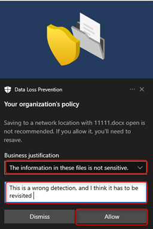
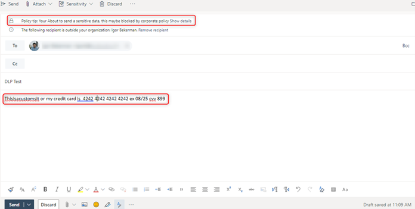
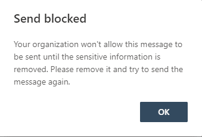
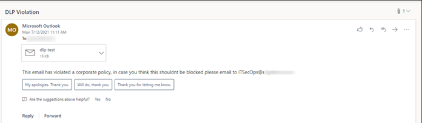
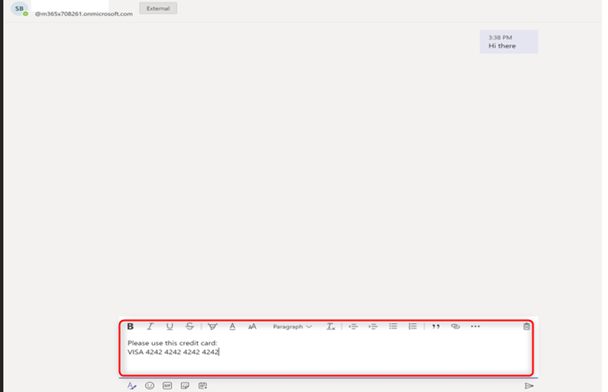
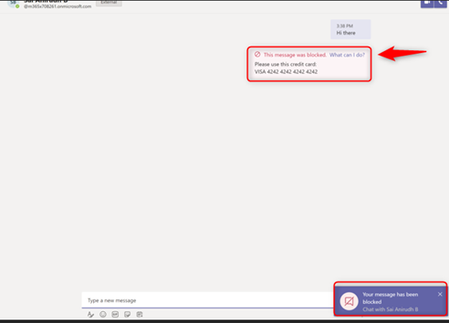
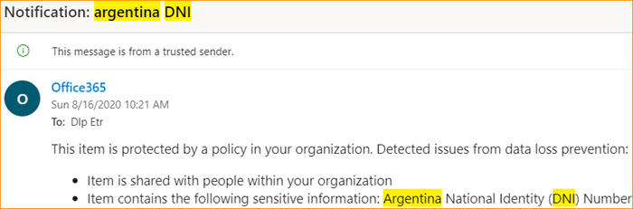
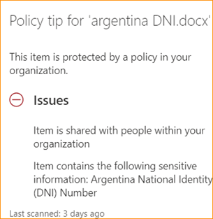
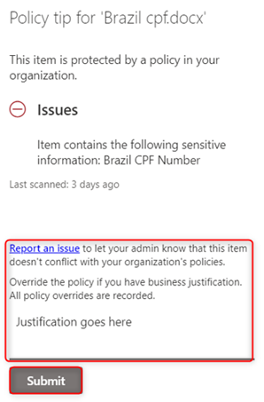

# Microsoft DLP User Education & User Experience 

## Purpose

The purpose of this document is to educate end users on the end user experience across O365 DLP when a violation occurs.

## Context

Based on the service consumed by the user, a user might be blocked from doing certain action on the various channels covered by O365 DLP, the purpose of this document is to educate on how to react in case a violation occurred, and an action is required, by doing this user will be familiar with the procedure and will get educated.

**Channels Covered by O365 DLP**

* Device (Your corporate desktop)
* Exchange Online (Your mailbox)
* SharePoint / OneDrive (your corporate shared / personal storage)
* Teams (Your corporate collaboration platform)

**Notifications on your desktop when using or reproducing sensitive content:** 

Based on your activities on the device, you (the end user), might violate a corporate policy for certain content of data being exfiltrated based on various activities on the endpoint, the list of activities that might trigger an action are the following:

* Upload to cloud service domains or access by unallowed browsers
* Copy to Clipboard
* Copy to a USB removable media.
* Copy to network share.
* Access by unallowed apps
* Print
* Transfer via Bluetooth
* Remote Desktop Services 

Based on the corporate policy some actions from the above list may trigger an audit action, block restriction, or block with an option to override.

To get familiar with the look and feel the Block & Block with override activities the following Toast message (right low corner) will pop up when a violation occurs. 

**Block with no override option**

When blocked without an option to override, a user violating a policy will get the following a popup message (toast message):

<figure>
     
    <figcaption>Figure 1: Toast message: Block no override.</figcaption>
</figure>

**Block with override option**

When blocked with an option to override, an administrator might allow you to pick from a pre-defined list of options with an option to input a customized text:

<figure>
     
    <figcaption>Figure 2: Toast message: Block with override.</figcaption>
</figure>

<figure>
     
    <figcaption>Figure 3: Toast message: Block with override, Business justification options.</figcaption>
</figure>

<figure>
     
    <figcaption>Figure 4: Toast message: Block with override, business justification options, notes.</figcaption>
</figure>

### Notifications on your outlook when sharing sensitive content 

When sending an email with sensitive data, this email might be rejected from being sent out to the recipient.
Based on the policy setting, you may get a message prior the sent out with a Policy Tip notifying that your about to violate a DLP policy and it might be blocked.

<figure>
     
    <figcaption>Figure 5: Email with policy time.</figcaption>
</figure>

<figure>
     
    <figcaption>Figure 6: Send block notification.</figcaption>
</figure>

In some use cases you might be able to send the message and you will get blocked on post send, by configuration a user might get a notification that details the violating message and action taken with an explanation (configured by the corporate administrator).

<figure>
     
    <figcaption>Figure 7: DLP email notification of violation.</figcaption>
</figure>

### Notification on Microsoft Teams when sharing sensitive content 

A DLP policy helps organizations prevent data loss. It also helps users to make better decisions when sending Sensitive Information Types knowingly or unknowingly.
Currently, Teams-DLP supports protecting data while sharing a message or a file that contains sensitive information via 1-1 Chat or through channel messages. 

**Protecting Sensitive Information in Messages:**

If someone is trying to share a chat message that contains sensitive information to an external user/guest, based on the creation of DLP-Rule for the Teams workload, the message will be blocked within seconds. Both the sender and receiver see the message blocked notification.

**User Experience**
_Sender’s Screen:_

The Sender is attempting to send credit card information to the newly created federation user via 1-1 chat:

<figure>
     
    <figcaption>Figure 8: Sending Teams Message.</figcaption>
</figure>

<figure>
     
    <figcaption>Figure 9: Message blocked on sender.</figcaption>
</figure>

The message is blocked as the DLP rule is activated and the sender is notified:

_Receiver Screen:_

<figure>
     
    <figcaption>Figure 10: Message blocked and removed on receiver.</figcaption>
</figure>

The receiver gets a blank blocked message, as shown below. Please note that there will be a delay of a few seconds in blocking the message and which is normal behavior (passive DLP).

[Teams DLP end user experience - Video](https://aka.ms/mipc/teamsdlpvideo3) 

### Protecting Sensitive Information in Documents Sharing:

If a user attempts to share a document that contains sensitive information with external users/guests in a Microsoft Teams Channel or chat, the DLP rule prevents opening the document by the external user. Note that, in this case, the DLP policy must include SharePoint and OneDrive locations for protection to be in place.

**SharePoint / OneDrive Online**

In SharePoint and OneDrive Online as a user you might share files and documents with internal and external entities, based on your organizational settings you might violate corporate policy with an action of notifying or blocking your documents / files from being shared.

In case of a policy violation, you might receive an email + Policy Tip detailing the violation and the desired course of action.

For example, a red triangle will appear near to a file that violated a policy (Argentina National identity number)

<figure>
     
    <figcaption>Figure 11: Document with violation.</figcaption>
</figure>

An email explaining the violation might be sent to you as a user.

<figure>
     
    <figcaption>Figure 12: Email of policy violation.</figcaption>
</figure>

And a policy tip might appear as well.

<figure>
     
    <figcaption>Figure 13: Policy tip.</figcaption>
</figure>

In some cases your admin might configure the ability to override a violating file / document, in such scenario before overriding the violating file will appear with the red triangle.

<figure>
     
    <figcaption>Figure 14: Document with violation.</figcaption>
</figure>

And after overriding the red triangle notification will be removed.

<figure>
     
    <figcaption>Figure 15: Document after override.</figcaption>
</figure>

To override you need to select “Override the policy if you have a business justification, all policy overrides are recorded”.

<figure>
     
    <figcaption>Figure 16: Policy tip with override.</figcaption>
</figure>

In more severe cases your admin might set a policy that will block you from sharing a file containing sensitive content, in such case you will get a message stating that the file cant be shared and a “No entry” sign.

<figure>
     
    <figcaption>Figure 17: Document with block icon.</figcaption>
</figure>

On sharing dialog:

<figure>
     
    <figcaption>Figure 18: Sharing dialog box.</figcaption>
</figure>

And a policy tip stating:

<figure>
     
    <figcaption>Figure 19: Policy tip.</figcaption>
</figure>

