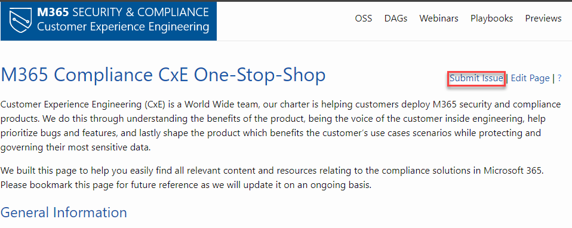
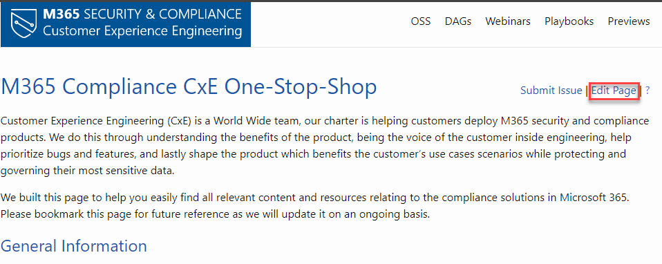

The Compliance CxE team encourages collaboration of our content.  This article describes how you can contribute.

## Submitting an Issue

Notice something incorrect? Have a comment? Submit an issue or make a comment.

1. Select the 'Submit Feedback as an Issue'  icon at the top right of the page.

    

1. This will take you to GitHub, where you will fill out a new 'Issue', then click *Submit new issue*

    > **NOTE:** You must be logged in to GitHub to submit an issue.

    

## Quick Editing a Page

Want to just make quick changes yourself?

1. Select the 'Edit Page' link at the top right of the page.

    

1. In GitHub, select the pencil icon to the edit the article

    > **NOTE:** You must be logged in to GitHub or the edit button will be greyed out

    

1. Make changes in the web editor. Click the *Preview changes* tab to check formatting of your change.

1. Once you have made your changes, scroll to the bottom of the page. Enter a title and description for your changes and click *Propose file change*

    

1. Now that you've proposed your change, you need to ask the owners of the repository to "pull" your changes into their repository. This is done using something called a "pull request". When you select *Propose file change*, a new page similar to the following is displayed:

    

    Select Create pull request, enter a title, and optionally a description for the pull request, and then select Create pull request. If you are new to GitHub, see About Pull Requests for more information.

1. That's it! Content team members will review and merge your PR when it's approved. You may get feedback requesting changes.