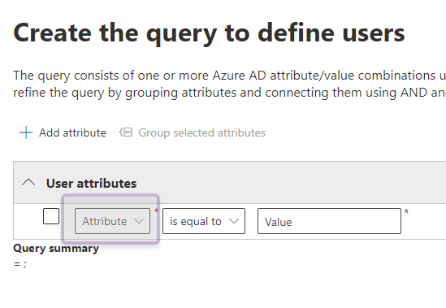
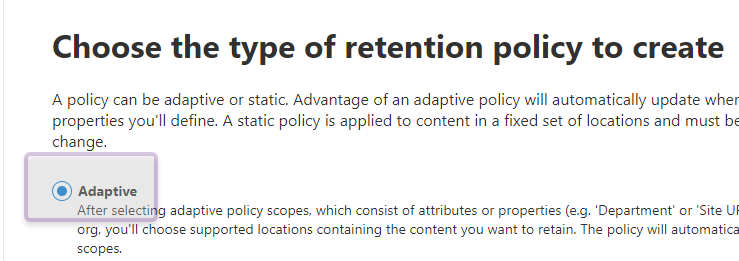

# Adaptive Policy Scopes - Exchange Workload

The JumpStart series is intended to help companies start with a simple approach to governing data residing in the M365 platform by reducing the complexity of knowing where to start, taking the first steps to reduce risk, and complying with laws on how the data is governed.

Great, but what if I don’t know what I don’t know. Developing an organisational policy takes time given the number of business roles involved.  What data are we supposed to protect? How much data should we retain? Sadly, if you’re not governing anything now, you have no way to ensure that data isn’t being deleted by a disgruntled employee or someone with malicious intent while that policy gets developed. The below guidance helps you to begin gathering an understanding of the potentially sensitive data within the Exchange workload and provides helpful insights that you can use to determine what actions are needed to effectively govern this data over the next few months.

The mindset behind this approach allows the start of classifying content that then can be reviewed in activity explorer and content explorer. Using content explorer [Getting started with content explorer](https://docs.microsoft.com/en-us/microsoft-365/compliance/data-classification-content-explorer?view=o365-worldwide#:~:text=How%20to%20use%20content%20explorer%201%20Open%20Microsoft,the%20label%20from%20the%20list.%20More%20items...%20) allows a quick point in time view of how the label is applied to items in M365 before acting on the data and predicts outcome for organizational compliance with regulation. Activity explorer [Getting started with activity explorer](https://docs.microsoft.com/en-us/microsoft-365/compliance/data-classification-activity-explorer?view=o365-worldwide) builds on content explorer displaying the history of how the data is labeled.

We detail a single common method for applying a retention policy that can cover the specific country/region or city, etc.. within your organization. For more of an in-depth guide to Information Governance, refer to [Deployment Accelerator Guide](../..dag/mig-rm). Do know the below step-by-step will be a cumulative activity that starts as a building block for your company's governance strategy. The first step is putting a retention policy in place to apply a base level of data governance before deciding on the labels to apply.

## Getting Started

**Start by using user data that contians country or region attributes** 

### Creating scopes

1. Log into the Microsoft 365 compliance center at compliance.microsoft.com
2. Select **Information Governance** from the left pane

    <figure>
         
        <figcaption>Figure 1: Home page of Microsoft 365 compliance center</figcaption>
    </figure>

3. Under the **Adaptive Scopes** tab, click **Create Scope**.

    <figure>
         
        <figcaption>Figure 2: Adaptive scopes tab on Information Governance page with Create Scope action selected</figcaption>
    </figure>

4. On the **Name Your Adaptive Policy Scope** page of the **Create Adaptive Scope** wizard, add a name for the scope and a description. Click **Next** to continue.

    <figure>
         
        <figcaption>Figure 3: Name Your Adaptive Policy Scope page with Name box and Description box selected</figcaption>
    </figure>

### User scope

5.	On the **What Type Of Scope Do You Want To Create?** Page, select **Users** as the scope. Click **Next** to continue.

    <figure>
         
        <figcaption>Figure 4: What Type Of Scope Do You Want To Create page with Users radio button selected</figcaption>
    </figure>

### Region attribute

6.	On the **Create The Query To Define Users** page under **User Attributes** section, select **Country Or Region** from the drop down.

    <figure>
         
        <figcaption>Figure 5: Create The Query To Define Users page with Attribute dropdown box selected</figcaption>
    </figure>
    <figure>
         
        <figcaption>Figure 6: Within the Attribute dropdown box, Country Or Region is selected</figcaption>
    </figure>

7.	In the **Value** box enter the name of region for the scope this applies to. Click **Next** to continue.

    <figure>
         
        <figcaption>Figure 7: Value text box populated with region equal to US</figcaption>
    </figure>

!!! Tip
    If needing to add more regions, simply click **Add Attribute** then repeat steps 6 & 7. You can also add City, Office, Department or Job Title as well during this step.

8.	On the **Review And Finish** page, edit any information that maybe incorrect then click Submit.

### Create retention policy using scope

1.	Return to the Information Governance landing page and click **Retention Policies** tab.

    <figure>
         
        <figcaption>Figure 8: Information Governance main page with Retention Policies selected</figcaption>
    </figure>

2.	Select **New Retention Policy**.

    <figure>
         
        <figcaption>Figure 9: Information Governance main page with New Retention Policy selected</figcaption>
    </figure>

3.	On the **Name Your Retention Policy** page, add a name for the retention policy and a description. Click **Next** to continue.

    <figure>
         
        <figcaption>Figure 10: Name Your Retention Policy page with Name and Description fields shown</figcaption>
    </figure>

### Adaptive scope policy

4.	On the **Choose The Type Of Retention Policy To Create** page, select **Adaptive** and click **Next**.

    <figure>
         
        <figcaption>Figure 9: Choosing the type of retention policy with Adaptive radio button selected</figcaption>
    </figure>

5.	On the **Choose Adaptive Policy Scopes And Locations** page, click **Add Scopes**.

    <figure>
         
        <figcaption>Figure 11: Choosing the adaptive policy scope and location with Add Scopes selected </figcaption>
    </figure>

6.	On the **Choose Adaptive Policy Scopes** dialog box, choose the scope created earlier in step x. Click **Add** to continue.

    <figure>
         
        <figcaption>Figure 12: Choosing the adaptive policy scope with Email Only Region selected </figcaption>
    </figure>

### Adding Exchange workload

7.	Under the **Choose Locations To Apply The Policy** section, verify the only **Status** set to **On** is **Exchange Email**. Click **Next** to continue.

    <figure>
         
        <figcaption>Figure 13: Chosing the adaptive policy scope with Exchange Email Status set to On </figcaption>
    </figure>

### Configuring retention period

8.	On the **Decide If You Want To Retain Content, Delete It, Or Both** page, leave the radio button **Retain Items For A Specific Period** selected, choose **Custom** from the dropdown menu then adjust the retention to 1 year and finally select the **Do Nothing** radio button. Click **Next** to continue.

    <figure>
         
        <figcaption>Figure 14: Configuring retention period to 1 year and at the end of this period Do Nothing enabled </figcaption>
    </figure>

9.	Lastly, review settings and make changes if need be then click **Submit**.

On behalf of the **G**overnance, **e**Discovery, **A**udit, **R**ecords -GEAR engineering team, we would like to recognize the contributions of the following persons to this post:

Joanne Klein - Microsoft MVP, Compliance SME
