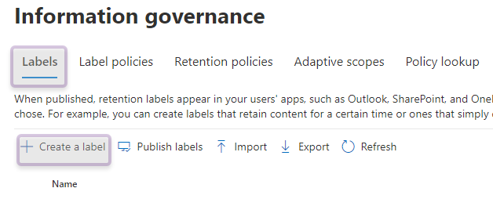
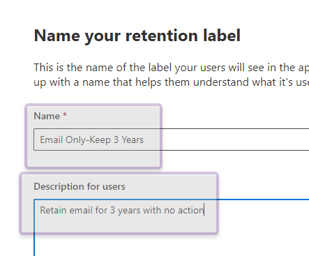
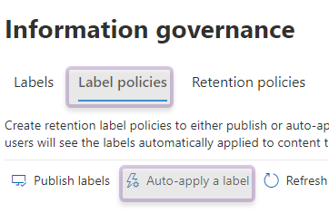
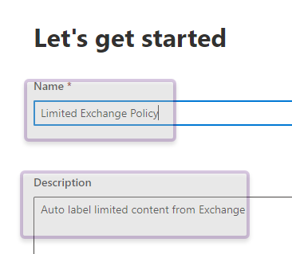
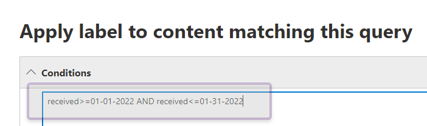
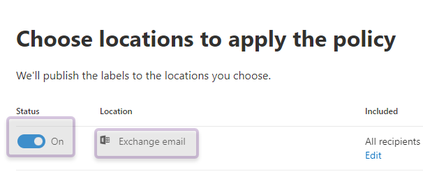
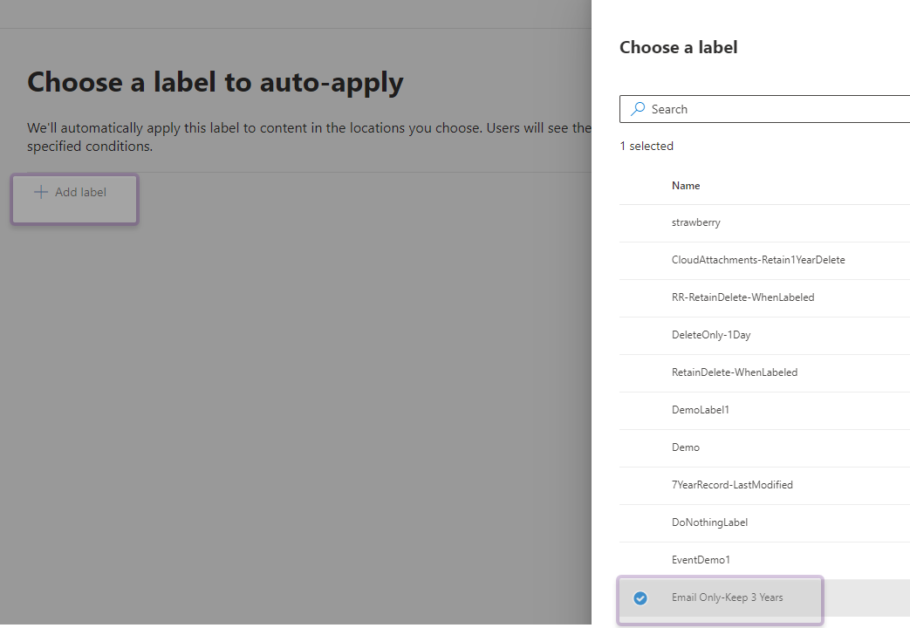

# AutoApply with KQL - Exchange Workload

The JumpStart series is intended to help companies start with a simple approach to governing data residing in the M365 platform by reducing the complexity of knowing where to start, taking the first steps to reduce risk, and complying with laws on how the data is governed.

Great, but what if I don’t know what I don’t know. Developing an organisational policy takes time given the number of business roles involved.  What data are we supposed to protect? How much data should we retain? Sadly, if you’re not governing anything now, you have no way to ensure that data isn’t being deleted by a disgruntled employee or someone with malicious intent while that policy gets developed. The below guidance helps you to begin gathering an understanding of the potentially sensitive data within the Exchange workload and provides helpful insights that you can use to determine what actions are needed to effectively govern this data over the next few months.

The mindset behind this approach allows the start of classifying content that then can be reviewed in activity explorer and content explorer. Using content explorer [Getting started with content explorer](https://docs.microsoft.com/en-us/microsoft-365/compliance/data-classification-content-explorer?view=o365-worldwide#:~:text=How%20to%20use%20content%20explorer%201%20Open%20Microsoft,the%20label%20from%20the%20list.%20More%20items...%20) allows a quick point in time view of how the label is applied to items in M365 before acting on the data and predicts outcome for organizational compliance with regulation. Activity explorer [Getting started with activity explorer](https://docs.microsoft.com/en-us/microsoft-365/compliance/data-classification-activity-explorer?view=o365-worldwide) builds on content explorer displaying the history of how the data is labeled.

We detail a single common method for  auto applying a retention label that queries emails between certian time periods within your organization. For more of an in-depth guide to Information Governance, refer to [Deployment Accelerator Guide](../..dag/mig-rm). Do know the below step-by-step will be a cumulative activity that starts as a building block for your company's governance strategy. The first step is putting a retention policy in place to apply a base level of data governance before deciding on the labels to apply.

## Getting Started

**Start by configuring retention label that retains only** 

### Creating retention label

1. Log into the Microsoft 365 compliance center at compliance.microsoft.com
2. Select **Information Governance** from the left pane

    <figure>
         
        <figcaption>Figure 1: Home page of Microsoft 365 compliance center</figcaption>
    </figure>

3. On the main page of **Information Governance**, click **Labels** tab then click **Create A Label**.

    <figure>
         
        <figcaption>Figure 2: Labels tab on Information Governance page with Create A Label selected</figcaption>
    </figure>

4. On the **Name Your Retention Label** page of the **Create Retention Label** wizard, add a name for the label and a description. Click **Next** to continue.

    <figure>
         
        <figcaption>Figure 3: Name Your Retention Label page with Name box and Description box selected</figcaption>
    </figure>

5. On the **Define Retention Settings** page, leave the radio button **Retain Items For A Specific Period** selected, choose **Custom** from the dropdown menu then adjust the retention to 3 years and finally select **Do Nothing** radio buttons. Click **Next** to continue.

    <figure>
         
        <figcaption>Figure 4: Configuring retention period to 3 years and at the end of this period Do Nothing enabled </figcaption>
    </figure>

6. Lastly, review settings and make changes if need be then click **Create Label**.

### Auto-applying a label using KQL query

7. On the **Information Governance** page, under the **Label Policies** tab click **Auto-apply A Label**.

      <figure>
         
        <figcaption>Figure 5: Labels Policies tab on Information Governance page with Auto-apply A Label selected </figcaption>
    </figure>

 8. On the **Let's Get Started** page of the **Create Auto-labeling Policy** add a name for the label and a description. Click **Next** to continue.  

      <figure>
         
        <figcaption>Figure 6: Let's Get Started page with Name box and Description box selected</figcaption>
    </figure>

9. On the **Choose The Type Of Content You Want To Apply This Label To** page, select **Apply Label To Content That Contains Specific Words Or Phrases, Or Properties** radio button. Click **Next** to continue.

  <figure>
         
        <figcaption>Figure 7: Selecting the type of content to apply label to </figcaption>
    </figure>

### Adding KQL query criteria

10. On the **Apply Label To Content Matching This Query** page, enter the KQL query in the **Conditions** box as shown below. Click **Next** to continue. 

      <figure>
         
        <figcaption>Figure 8: Inputing KQL query into the Conditions box for content that mataches query </figcaption>
    </figure>

### Static Scope

10. On the **Choose The Type Of Retenetion Policy To Create** page, select **Static** as the scope and then click **Next** to continue.

      <figure>
         
        <figcaption>Figure 9: Selecting Static scope </figcaption>
    </figure>

### Adding Exchange workload

11. On the **Choose Locations To Apply The Policy** page, ensure the **Status** for Exchange Email is set to **On** only and then click **Next** to continue.

     <figure>
         
        <figcaption>Figure 10: Choosing Exchange Email workload only to apply policy location to </figcaption>
    </figure>

### Adding retention label to policy

12. On the **Choose A Label To Auto-apply** page, click **Add Label** then choose the label you created earlier. Click **Add** and click **Next**.

     <figure>
         
        <figcaption>Figure 11: Selecting retention label for auto-apply policy </figcaption>
    </figure>

13. Lastly, review settings and make changes if need be then click **Submit**.

On behalf of the **G**overnance, **e**Discovery, **A**udit, **R**ecords -GEAR engineering team, we would like to recognize the contributions of the following persons to this post:

Joanne Klein - Microsoft MVP, Compliance SME