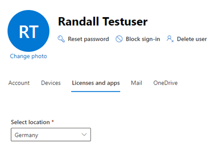
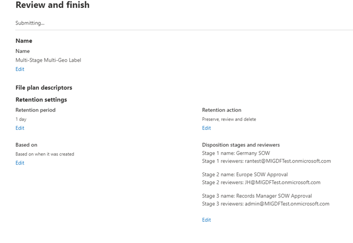
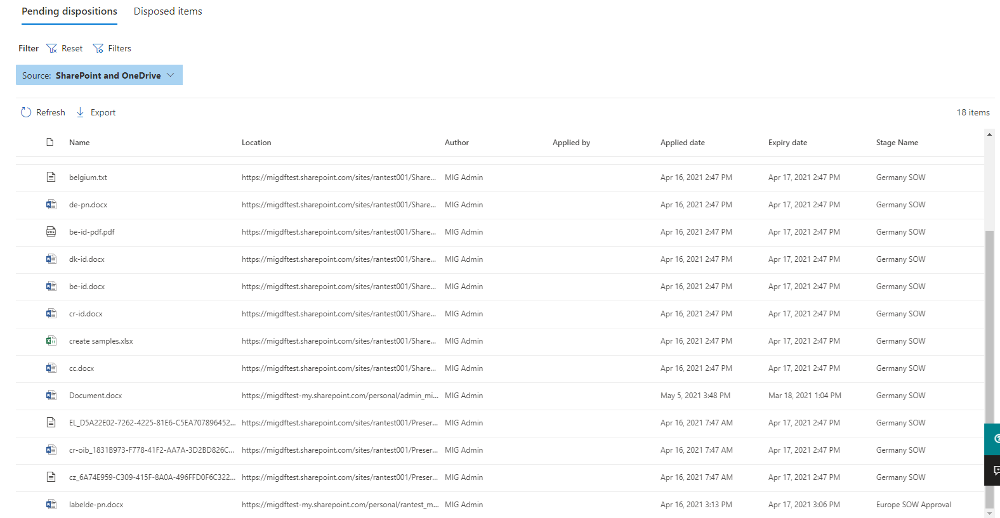

# Now in public preview

!!! info
    test for today

## Overview    
In the past, when content reached the end of the period of retention people would receive an email notification to take action. The 'Records Manager' or 'Disposition Reviewer' then would use the Disposition tab in Records Management to review the labels acting upon items to then dispose or permanently delete, extend the retention period or apply another label. 

For a detailed overview of the disposition process, refer to the Microsoft document [here](https://docs.microsoft.com/en-us/microsoft-365/compliance/disposition?view=o365-worldwide).

<figure>
     
    <figcaption>Figure 1: Label creation with disposition trigger.</figcaption>
</figure>

<figure>
     
    <figcaption>Figure 2: Adding user or mail enabled security group.</figcaption>
</figure>

This process left a gap for large complex companies needing to streamline the disposition process since all the appropriate people would need to give approval before any action could be taken. One can imagine this could be a simple internal process or an extremely complex workflow. This led to the recrods manager or approver seeing all items needing disposition.

We heard this feedback from our customers that people should only see what items they are assigned to and are ready for disposition but not all items needing disposition. With this in mind, we developed multi-stage disposition.

We are excited to share the new capabilities in MIG:

*	Multiple stage and reviewers
*	Support for multi-geo
*	Email customization and templates
*	Reviewer experience (in line view, taking actions)
*	Adding reviewers to a stage
*	History and details tab

We will discuss one such use case scenario here that leverages these new features. 

!!! tip
    For a detailed explanation or instructions for implementing the new features of multi-stage click this  [link](https://techcommunity.microsoft.com/t5/security-compliance-identity/end-user-training-for-retention-labels-in-m365-how-to-accelerate/ba-p/1750861).

## Scenario 

The example below is more a general example that can be applied to all industries as regulations or company policy may not be the same in all parts of the world.

A global company that conducts business in Europe and is headquartered in California. The company needs to define a process of disposition to accommodate specific people or departments in Germany who are tasked with a review of records that are expired complying with **BaFin**, **GDPR** and **CPRA** regulations. These records consist of contracts in the region of the world the company conducts business. 

The record manager of the company needs to create a process for taking actions for expired records and ensure the process is followed as defined by the company’s retention schedule. Some departments have a regional lead that oversees all the contract specialists in each country who might all have input into if record needs to be disposed. These subject matter experts for record types will need to approve items for disposition that are assigned to them and the ability to view the context of the record. 

The company needs both the contract specialist or regional lead and records manager to approve all records needing disposition review but only see the relevant items they are realted to their job function. Contract specialists need email notifications daily with the correct instructions and approval guidance in multiple languages to accommodate global workforce. 

The records manager needs email notification instructions and business guidance that differ from the contract’s specialist or regional lead. The records manager needs a unified disposition process across all the locations of the world and reporting for proof disposed items are not discoverable. Lastly, if business structure or change management dictate, require the ability to update the disposition process while adhering to the companies defined retention schedule.

We will use the below workflow to map the business use case to the solution.

<figure>
     
    <figcaption>Image 1: Label workflow with multi-stage dispsotion</figcaption>
</figure>

Relating to the requirements above, there are three users in our tenant mapping to each role.

- **Randall Testuser** – Contract’s Specialist in Europe (Germany)

- **Joanna Hackett** – WW Lead for Contracts

- **MIG Admin** – Records Manager

As you can see from the screenshots below both Joanna and MIG Admin are located in the United States (California) and Randall works in Germany.
!!! note
    For an overview of M365 multi-geo and Preferred Data Location (PDL) visit [here](https://docs.microsoft.com/en-us/microsoft-365/enterprise/microsoft-365-multi-geo?view=o365-worldwide)

<figure>
     
    <figcaption>Figure 3: User with PDL in Germany</figcaption>
</figure>

<figure>
     
    <figcaption>Figure 4: User with PDL in USA</figcaption>
</figure>

We create a new retention label with the record option in the File Plan called *Multi-Stage Multi-Geo Label*, with a 1 day retain,  and triggering a dispostion at the end of this time period. 

The label below shows three stages and three reviwers: 

- Stage 1 called: Germany SOW 
- Stage 2 called: Europe SOW Approval  
- Stage 3 called: Records Manager SOW Approval 

<figure>
     
    <figcaption>Figure 5: Settings of Multi-Stage Multi-Geo retention label.</figcaption>
</figure>

!!!note 
    The label shows a setting of 1 day but should be set to the requirement of your organization or regulation. The label name could be *Contracts* as an example here or any other nomenclature that resonates within your business.

Our next step is to create a retention policy called *Multi-Stage Multi-Geo Policy* publishing label *Multi-Stage Multi-Geo Label*. The published label covers one exchange mailbox, one Sharepoint site and two user OneDrive locations.

<figure>
     
    <figcaption>Figure 6: Auto-applied label settings.</figcaption>
</figure>

We configured the policy to Randall Testuser’s email, a SharePoint site used by **Randall Testuser** in Germany for SOWs, and include both **Randall Testuser’s** + **MIG Admin’s** OneDrive locations.

Next we move to configuring the email notifications once items are ready for disposal. In addition to the default message we are adding instructions for **Randall Testuser** on expiring SOW contracts in Germany along with instructions for California expiring SOW contracts.

Notice the first line is in German (**Please verify all SOWs conform to BaFIN regulations.**) and the second line is in English.

<figure>
     
    <figcaption>Figure 7: Customize message for email notification.</figcaption>
</figure>

Once an item is up for dispostion, the persons or security group added to the first stage are sent one mail per day per label similar to the email shown below.

<figure>
     
    <figcaption>Figure 8: Email notification from O365 Security & Compliance Center.</figcaption>
</figure>

Now we are moving to the Microsoft Compliance Center (MCC) to review items for disposition for **Randall Testuser** notified above in email. We see the items ready for dispostion that are assigned to **Randall Testuser** as the approved or assigned *dispostion reviewer* for the first stage name called Germany SOW.

<figure>
     
    <figcaption>Figure 9: Stage 1 disposition view.</figcaption>
</figure>

Compared to the view of record manager role, one can see that **Randall Testuser** has 17 items under the *Multi-Stage Multi-Geo Label* (shown in Figure 9) and **MIG Admin** shows 18 items including one item in the second stage called Europe SOW Approval (shown in Figure 10).

<figure>
     
    <figcaption>Figure 10: Stage 1 and Stage 2 disposition view.</figcaption>
</figure>

**Randall Testuser** will follow guidance to **Approve** the dispostion or **Relabel** or **Extend** or **Add** additional Reviewers to each item. Once approving an item for dispostion, it will flow the second stage.

<figure>
     
    <figcaption>Figure 11: Item view actions avaialable.</figcaption>
</figure>

As **Randall Testuser** clicks on an item, he can quickly see the context to make an informed decision.

<figure>
     
    <figcaption>Figure 12: Context view of item.</figcaption>
</figure>

Once clicking approve it move to the Europe SOW Approval and **Joanna Hackett** is notified to then review items for disposition in the second stage.

<figure>
     
    <figcaption>Figure 13: Stage 2 view of item.</figcaption>
</figure>

**Joanna Hackett** approves item above and adds her comments for the disposition action as seen below in the history pane.

<figure>
     
    <figcaption>Figure 14: History of actions and comments.</figcaption>
</figure>

Lastly the item follows the flow to the final stage for **MIG Admin** our records administrator to approve the dispostion. Before doing so, an email was sent out by legal stating all contracts from Germany need to be immutable with a 55 year retention hold per new regulation guidance that came out in the last week. **MIG Admin** then adds **Nancy Liang** from legal to the review process.

<figure>
     
    <figcaption>Figure 15: Adding legal reviwer and comments.</figcaption>
</figure>

**Nancy Liang** follows the same steps after receiving email to review the item for disposition. She will then **Relabel** the item as a regulatory record *Multi-Stage Multi-Geo Regulatory Label* that has a retention record of 55 years.

<figure>
     
    <figcaption>Figure 16: Regulatory label summary with retention duration</figcaption>
</figure>

<figure>
     
    <figcaption>Figure 17: Relabel action and comments</figcaption>
</figure>

On behalf of the MIG PM team, we would like to recognize the contributions of the following persons to this post:

Joanne Klein - Microsoft MVP

Brendon Lee - Extended Compliance CXE