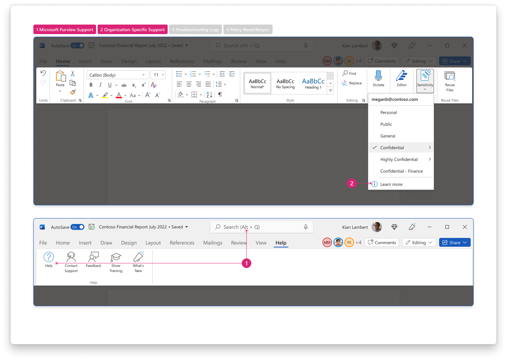
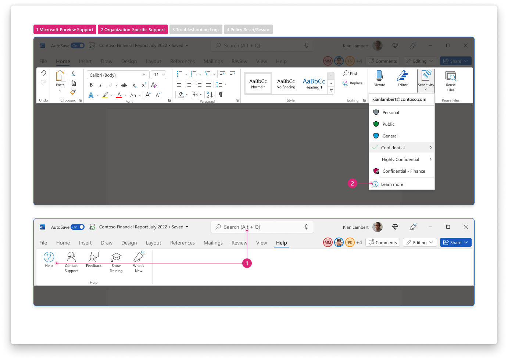

 
[`➡️ Get Started`](../../GetStarted.md) > [`➡️ Step 1`](../../AIP2MIPStep1.md) > [`➡️ Step 2`](../../AIP2MIPStep2.md) > [`➡️ Step 3`](../../AIP2MIPStep3.md) > [`➡️ Step 4`](../../AIP2MIPStep4.md)[***`Change Guide`***](../../CompareAIP2MIP.md) > [`➡️ Step 5`](../../AIP2MIPStep5.md)

# `User Interface` / `Help & Feedback`

Help & feedback tools allow users to get support or help troubleshoot issues.

## Product Capabilities
The table below lists the main use cases for this feature and its transition from the AIP Add-in to the built-in labeling solution. These are mapped to product screenshots in the next section.

| Use Case  | :simple-microsoftazure: Add-In :material-download: [`Latest`][AIPLatest] | :material-microsoft-office: Built-In :material-cloud-download: [`Current Channel`][MIPLatest] | :material-microsoft-office: Built-In :material-calendar-clock: `Coming Soon` |
| :---- | :---- | :---- | :---- |
| :material-numeric-1-circle:{ .num  } **Microsoft Purview sensitivity labels support** How do users access support information about sensitivity labels? | :material-shield-check:{ .success } `Supported` Users are linked to Microsoft's support information for AIP. | :material-shield-check:{ .success } `Supported` Users can rely on in-app help in Office for support information about sensitivity labels | :material-shield-check:{ .success } `No change` |
| :material-numeric-2-circle:{ .num  } **Organization-specific sensitivity labels support** How do users access internal support information about sensitivity labels? | :material-shield-check:{ .success } `Supported` Admins can configure a link for users to "report an issue".  Requires advanced setting [`ReportAnIssueLink`][ReportAnIssueLink] | :material-shield-check:{ .success } `Supported` Admins can configure a [custom URL in compliance admin center][SCCCustomURL], displayed to users as "Learn More" in [Sensitivity Menu](SensitivityMenu.md), [Sensitivity Bar](SensitivityBar.md) | :material-shield-check:{ .success } `No change` |
| :material-numeric-3-circle:{ .num  } **Generate troubleshooting logs** How can users obtain troubleshooting logs to provide during support cases? | :material-shield-check:{ .success } `Supported` Users can export troubleshooting logs from Help & Feedback | :material-shield-check:{ .success } `Supported` Troubleshooting logs integrated into [Office diagnostic logs][OfficeDiag] | :material-shield-check:{ .success } `No change`|
| :material-numeric-4-circle:{ .num  } **Reset sensitivity labels** How can users reset/resync their sensitivity labels? | :material-shield-check:{ .success } `Supported` Help & Feedback window provides "reset settings" button. | :material-shield-check:{ .success } `Not Needed` Built-in labeling does not need explicit reset for identity changes or troubleshooting. When switching identities, Office built-in labeling automatically resets sensitivity labels and rebooting the app can generally resolve any policy sync issues. | :material-shield-check:{ .success } `No change` |
| ~~~~~~~~~~~~~~~~ | ~~~~~~~~~~~~~~~ | ~~~~~~~~~~~~~~~ | ~~~~~~~~~~~~~~~ |

### Change Management Notes

!!! note

    If you need access to the policy file for troubleshooting, this can be found in 
    `%localappdata%\Microsoft\Office\CLP`.

## Product Screenshots

Use the screenshots below to help you evaluate the visual changes that correspond to the numbered use cases above. 

See [Sensitivity Menu](SensitivityMenu.md), [Sensitivity Bar](SensitivityBar.md), [Sensitivity Status](SensitivityStatus.md) for more information about how the label color is used.

=== "Add-In :material-download:`Latest`"

    

=== "Built-In :material-cloud-download:`Current Channel`"

    

=== "Built-In :material-calendar-clock: `Coming Soon`"

    

## Learn More

Use these references to learn more about the end-user experience

:material-help-circle: [Learn about sensitivity labels][MIPHelp]

:material-help-circle: [Azure Information Protection unified labeling client administrator guide][AIPHelp]

:material-help-circle: [Overview of diagnostic log files for Office][OfficeDiag]

<!-- ============ LINKS =========== -->

[AIPLatest]: https://learn.microsoft.com/en-us/azure/information-protection/rms-client/unifiedlabelingclient-version-release-history
[MIPLatest]: https://learn.microsoft.com/en-us/microsoft-365/compliance/sensitivity-labels-office-apps#support-for-sensitivity-label-capabilities-in-apps

[ReportAnIssueLink]: https://learn.microsoft.com/en-us/azure/information-protection/rms-client/clientv2-admin-guide-customizations#add-report-an-issue-for-users
[OfficeDiag]: https://support.microsoft.com/en-us/office/overview-of-diagnostic-log-files-for-office-fba86aac-70dc-4858-ae1f-ec2034346cdf
[SCCCustomURL]: https://learn.microsoft.com/en-us/microsoft-365/compliance/sensitivity-labels?view=o365-worldwide#what-label-policies-can-do
[MIPHelp]: https://learn.microsoft.com/en-us/microsoft-365/compliance/sensitivity-labels
[AIPHelp]: https://learn.microsoft.com/en-us/azure/information-protection/rms-client/clientv2-admin-guide
