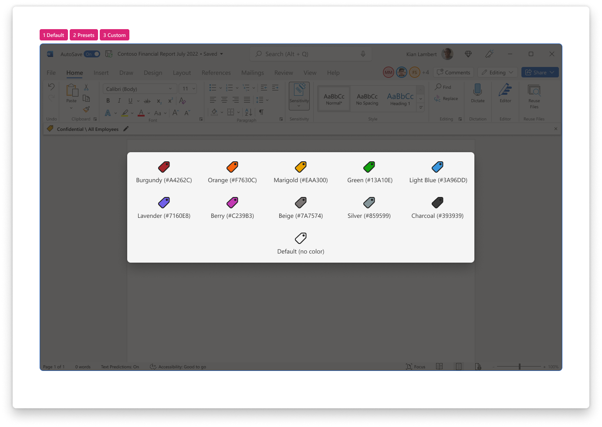
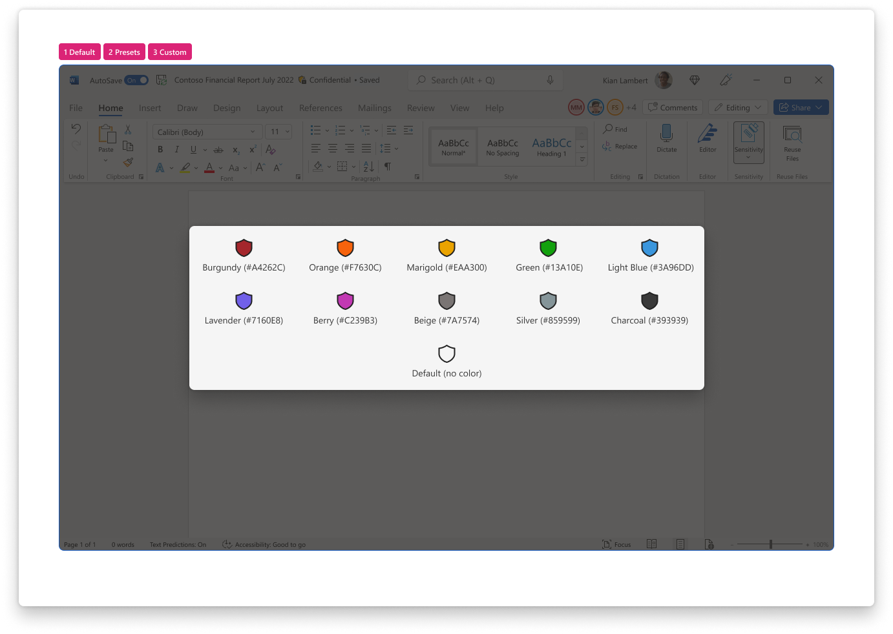

 
[`➡️ Get Started`](../../GetStarted.md) > [`➡️ Step 1`](../../AIP2MIPStep1.md) > [`➡️ Step 2`](../../AIP2MIPStep2.md) > [`➡️ Step 3`](../../AIP2MIPStep3.md) > [`➡️ Step 4`](../../AIP2MIPStep4.md)[***`Change Guide`***](../../CompareAIP2MIP.md) > [`➡️ Step 5`](../../AIP2MIPStep5.md)

# `User Interface` / `Label Color`

The label color helps end-users recognize a sensitivity label at-a-glance.

## Product Capabilities
The table below lists the main use cases for this feature and its transition from the AIP Add-in to the built-in labeling solution. These are mapped to product screenshots in the next section.

| Use Case  | :simple-microsoftazure: Add-In :material-download: [`Latest`][AIPLatest] | :material-microsoft-office: Built-In :material-cloud-download: [`Current Channel`][MIPLatest] | :material-microsoft-office: Built-In :material-calendar-clock: `Coming Soon` |
| :---- | :---- | :---- | :---- |
| :material-numeric-1-circle:{ .num  } **Default Color** How are labels represented when no color is chosen?   | :material-shield-check:{ .success } `Supported` When admins don't choose a color, label icon appears without a fill color |  :material-shield-off-outline:{ .notsupported } `Not Supported` | :material-shield-check:{ .success } `Supported` Same as AIP Add-in |
| :material-numeric-2-circle:{ .num  } **Preset Colors** How are labels represented one of the preset colors is chosen?   | :material-shield-check:{ .success } `Supported` Admins can select from 10 present colors in the compliance center, and visible in the label icon. |  :material-shield-off-outline:{ .notsupported } `Not Supported` | :material-shield-check:{ .success } `Supported` Same as AIP Add-in |
| :material-numeric-3-circle:{ .num  } **Custom Colors** How are labels represented when admins configure a custom color (HEX value)?  | :material-shield-check:{ .success } `Supported` Admins provide a HEX color value in Label Advanced Settings [`color`][AIPColors]. |  :material-shield-off-outline:{ .notsupported } `Not Supported` | :material-shield-check:{ .success } `Supported` Same as AIP Add-in |
| ~~~~~~~~~~~~~~~~ | ~~~~~~~~~~~~~~~ | ~~~~~~~~~~~~~~~ | ~~~~~~~~~~~~~~~ |

### Change Management Notes

!!! tip

    There's no need for admins to make changes to their colors when adopting built-in labels. 
    The currently-configured colors, if any, will be used as-is in Office apps.

## Product Screenshots

Use the screenshots below to help you evaluate the visual changes that correspond to the numbered use cases above. 

See [Sensitivity Menu](SensitivityMenu.md), [Sensitivity Bar](SensitivityBar.md), [Sensitivity Status](SensitivityStatus.md) for more information about how the label color is used.

=== "Add-In :material-download:`Latest`"

    

=== "Built-In :material-cloud-download:`Current Channel`"

    

=== "Built-In :material-calendar-clock: `Coming Soon`"

    

## Learn More

Use these references to learn more about the end-user experience

:material-help-circle: [Choose label color presets][SCCColors]

:material-help-circle: [End-User Support][IWToolbar]

:material-help-circle: [Office Insiders Blog][IWBlog]

<!-- ============ LINKS =========== -->

[AIPLatest]: https://learn.microsoft.com/en-us/azure/information-protection/rms-client/unifiedlabelingclient-version-release-history
[MIPLatest]: https://learn.microsoft.com/en-us/microsoft-365/compliance/sensitivity-labels-office-apps#support-for-sensitivity-label-capabilities-in-apps

[SCCToolbar]: https://learn.microsoft.com/en-us/microsoft-365/compliance/sensitivity-labels-office-apps?view=o365-worldwide#sensitivity-bar
[SCCColors]: https://learn.microsoft.com/en-us/microsoft-365/compliance/sensitivity-labels-office-apps?view=o365-worldwide#label-colors
[AIPColors]: https://learn.microsoft.com/en-us/azure/information-protection/rms-client/clientv2-admin-guide-customizations#specify-a-color-for-the-label
[IWToolbar]: https://support.microsoft.com/en-us/office/apply-sensitivity-labels-to-your-files-and-email-in-office-2f96e7cd-d5a4-403b-8bd7-4cc636bae0f9
[IWBlog]: https://insider.office.com/blog/sensitivity-bar-in-office-for-windows
