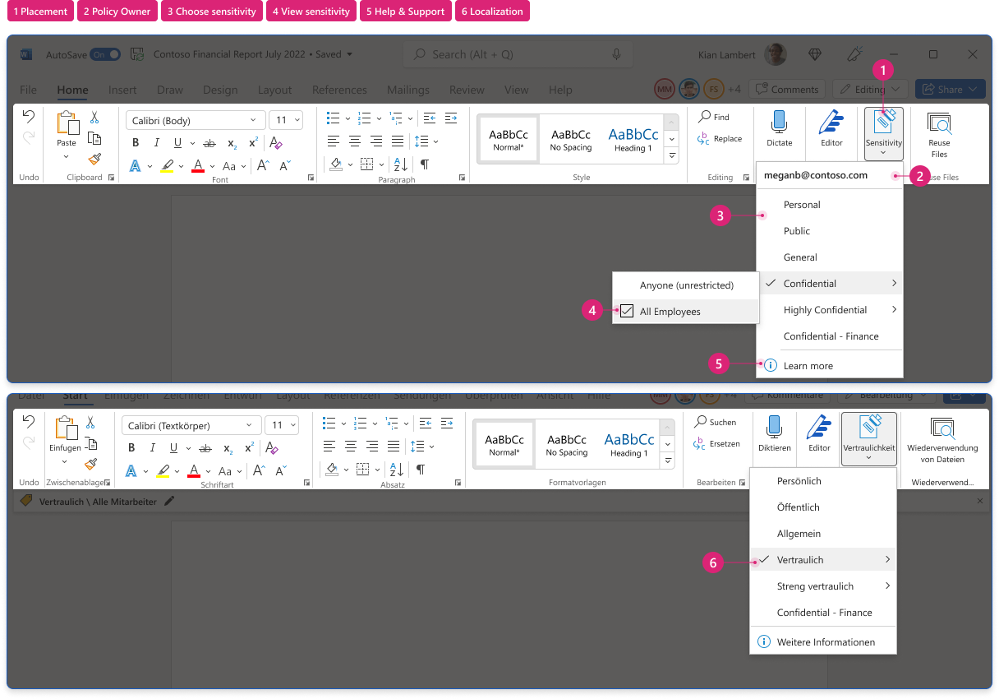
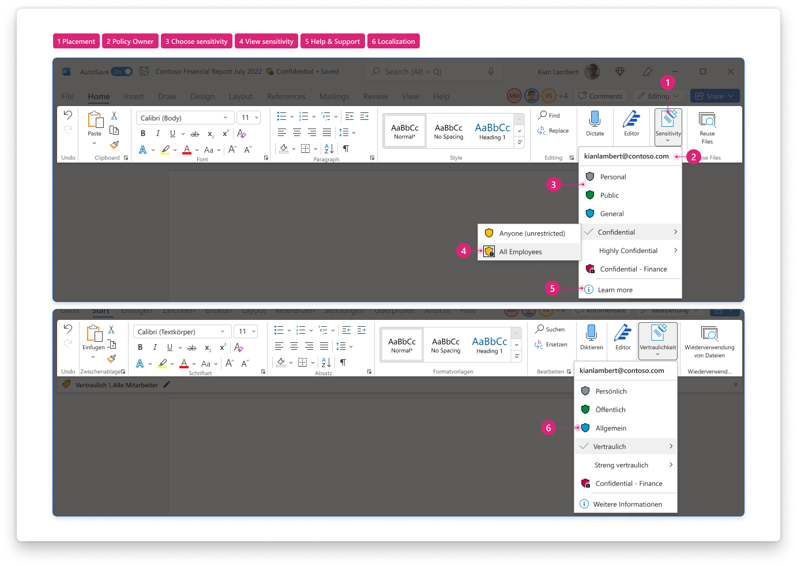

 
[`➡️ Get Started`](../../GetStarted.md) > [`➡️ Step 1`](../../AIP2MIPStep1.md) > [`➡️ Step 2`](../../AIP2MIPStep2.md) > [`➡️ Step 3`](../../AIP2MIPStep3.md) > [`➡️ Step 4`](../../AIP2MIPStep4.md)[***`Change Guide`***](../../CompareAIP2MIP.md) > [`➡️ Step 5`](../../AIP2MIPStep5.md)

# `User Interface` / `Sensitivity Menu`

The sensitivity menu is the primary method for users to apply labels that are assigned to them. It can be found in Home tab of the Ribbon in Word, Excel, PowerPoint, and Outlook.

## Product Capabilities

The table below lists the main use cases for this feature and its transition from the AIP Add-in to the built-in labeling solution. These are mapped to product screenshots in the next section.

| Use Case  | :simple-microsoftazure: Add-In :material-download: [`Latest`](AIPLatest) | :material-microsoft-office: Built-In :material-cloud-download: [`Current Channel`](MIPLatest) | :material-microsoft-office: Built-In :material-calendar-clock: `Coming Soon` |
| :---- | :---- | :---- | :---- |
| :material-numeric-1-circle:{ .num  } **Placement** How is the scenario surfaced to end users? | :material-shield-check:{ .success } `Supported` Sensitivity menu available in the Home tab of the application's Ribbon, positioned roughly in the middle of the ribbon alongside formatting options. |  :material-shield-check:{ .success } `Supported` Sensitivity menu available in the Home tab of the application's Ribbon. Positioned roughly near the end. | :material-shield-check:{ .success } `No change` |
| :material-numeric-2-circle:{ .num  } **Policy owner**  How are users reminded of which identity their available labels are pulled from? | :material-shield-off-outline:{ .notsupported } `Not Supported` |  :material-shield-check:{ .success } `Supported` Email address of signed-in user is visible at the top of the sensitivity menu. | :material-shield-check:{ .success } `No change` |
| :material-numeric-3-circle:{ .num  } **Choose sensitivity**  How do users interact with this to select or change sensitivity labels?  |  :material-shield-check:{ .success } `Supported` Sensitivity menu displays all labels published to the signed-in user in a hierarchical menu. Each label shows its name and selection state; label descriptions available as a tooltip. Users can remove a label by unchecking the selected label in the sensitivity menu (if they have the rights). | :material-shield-check:{ .success } `Supported` Same experience as AIP Add-in | :material-shield-check:{ .success } `Supported` Adds label color and encryption indicator to each label. |
| :material-numeric-4-circle:{ .num  } **View sensitivity** How is content's assigned sensitivity surfaced to users? | :material-shield-check:{ .success } `Supported` Label that's currently assigned to the content item appears selected in the sensitivity menu, even if the label is not published to the signed-in user. |  :material-shield-check:{ .success } `Supported` Same experience as AIP Add-in. See [note below](#change-management-notes) if content's label is not published to signed-in user. | :material-dev-to:{ .development  } `In Development` Sensitivity menu shows content's currently-applied label as selected in the menu, even when it's not published to the user's label policy. |
| :material-numeric-5-circle:{ .num  } **Help & Feedback**  Can users access organization-specific help and support information? | :material-shield-check:{ .success } `Supported` Users can access Help & Feedback window from sensitivity menu. | :material-shield-check:{ .success } `Supported` Users can launch admin-configured url for org-specific help page from sensitivity menu. | :material-shield-check:{ .success } `No change` |
| :material-numeric-6-circle:{ .num  } **Customizations**  Can users or admins customize this experience? | :material-shield-check:{ .success } `Supported` Users can choose to show/hide the sensitivity bar but cannot customize the sensitivity menu itself. |  :material-shield-off-outline:{ .notplanned  } `Not Applicable` | :material-shield-off-outline:{ .notplanned  } `Not Planned` Sensitivity bar is designed to always remain on screen near the document title or email subject. *See [Sensitivity Bar](SensitivityBar.md)* |
| :material-numeric-7-circle:{ .num  } **Localization**  How are label names and descriptions shown to users based on their language settings in Office? | :material-shield-check:{ .success } `Supported` Admins can define language mappings for label names and descriptions. [Learn more][SCCLanguages] |  :material-shield-check:{ .success } `Supported` Same as AIP | :material-shield-check:{ .success } `No change` |
| ~~~~~~~~~~~~~~~~ | ~~~~~~~~~~~~~~~ | ~~~~~~~~~~~~~~~ | ~~~~~~~~~~~~~~~ |

### Change Management Notes

!!! note

    With AIP Add-in, users see the document's current label as selected in the sensitivity menu, 
    even if the user is not assigned that label in their policy. With built-in labeling in current channel, 
    the sensitivity menu does not show the sensitivity labels that are not published to the current user. 
    See [Sensitivity Status](SensitivityStatus.md) for more information.

## Product Screenshots

Use the screenshots below to help you evaluate the visual changes that correspond to the numbered use cases above. 

=== "Add-In :material-download:`Latest`"

    

=== "Built-In :material-cloud-download:`Current Channel`"

    

=== "Built-In :material-calendar-clock: `Coming Soon`"

    

    

## Learn More

:material-help-circle: [Learn about sensitivity labels](SCCLabels)

:material-help-circle: [Apply sensitivity labels to your files and email in Office](IWLabels)

<!-- ============ LINKS =========== -->

[AIPLatest]: https://learn.microsoft.com/en-us/azure/information-protection/rms-client/unifiedlabelingclient-version-release-history
[MIPLatest]: https://learn.microsoft.com/en-us/microsoft-365/compliance/sensitivity-labels-office-apps#support-for-sensitivity-label-capabilities-in-apps

[SCCLabels]: https://learn.microsoft.com/en-us/microsoft-365/compliance/sensitivity-labels
[IWLabels]: https://support.microsoft.com/en-us/office/apply-sensitivity-labels-to-your-files-and-email-in-office-2f96e7cd-d5a4-403b-8bd7-4cc636bae0f9
[SCCLanguages]: https://learn.microsoft.com/en-us/microsoft-365/compliance/create-sensitivity-labels#example-configuration-to-configure-a-sensitivity-label-for-different-languages
