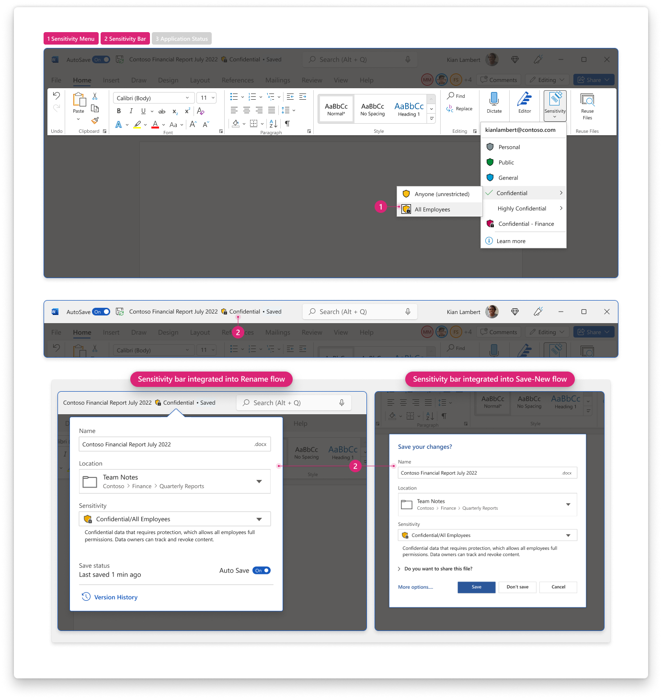

 
[`➡️ Get Started`](../../GetStarted.md) > [`➡️ Step 1`](../../AIP2MIPStep1.md) > [`➡️ Step 2`](../../AIP2MIPStep2.md) > [`➡️ Step 3`](../../AIP2MIPStep3.md) > [`➡️ Step 4`](../../AIP2MIPStep4.md)[***`Change Guide`***](../../CompareAIP2MIP.md) > [`➡️ Step 5`](../../AIP2MIPStep5.md)

# `User Interface` / `Sensitivity Status`

The sensitivity status shows what label is currently applied to a file or email.

## Product Capabilities
The table below lists the main use cases for this feature and its transition from the AIP Add-in to the built-in labeling solution. These are mapped to product screenshots in the next section.

| Use Case  | :simple-microsoftazure: Add-In :material-download: [`Latest`](https://learn.microsoft.com/en-us/azure/information-protection/rms-client/unifiedlabelingclient-version-release-history)| :material-microsoft-office: Built-In :material-cloud-download: [`Current Channel`](https://learn.microsoft.com/en-us/microsoft-365/compliance/sensitivity-labels-office-apps#support-for-sensitivity-label-capabilities-in-apps) | :material-microsoft-office: Built-In :material-calendar-clock: `Coming Soon` |
| :---- | :---- | :---- | :---- |
| :material-numeric-1-box:{ .num } **Sensitivity Menu**  Determines how the selected label is represented in the sensitivity menu.  *See [Sensitivity Menu](SensitivityMenu.md)*| :material-shield-check:{ .success } `Supported` Displays selected label in menu |  :material-shield-check:{ .success } `Supported` Same as AIP Add-in | :material-shield-check:{ .success } `No change` |
| :material-numeric-2-box:{ .num } **Sensitivity Bar**   Determines how the selected label is represented in the sensitivity bar. *See [Sensitivity Bar](SensitivityBar.md)*| :material-shield-check:{ .success } `Supported` Displays selected label in sensitivity bar. If the sensitivity bar is hidden, there is no directly-visible sensitivity status in the document unless the user expands the ribbon's sensitivity menu. |  :material-shield-off-outline:{ .notsupported } `Not Applicable` | :material-shield-check:{ .success } `Supported` Document's sensitivity status displayed in the sensitivity bar. |
| :material-numeric-3-box:{ .num } **Application Status**  Determines how the selected label is represented in the application status bar. | :material-shield-off-outline:{ .notsupported } `Not Supported` |  :material-shield-check:{ .success } `Supported` Displays selected label in application status bar alongside other document status indicators | :material-shield-check:{ .success } `Supported` Selected label status hidden by default in app status bar. See note below. |
| ~~~~~~~~~~~~~~~~ | ~~~~~~~~~~~~~~~ | ~~~~~~~~~~~~~~~ | ~~~~~~~~~~~~~~~ |

### Change Management Notes

!!! note

    *Removing Sensitivity Status from Application Status Bar*: The sensitivity status is hidden by default in the application status bar.
    This is because it's placement in the status bar is often missed by end-users and is unnecessary with the label status in the sensitivity 
    bar near the document title.

!!! note

    Users may have access rights to documents that are already labeled, even if the user doesn't have that label published in their policy. 
    With AIP Add-in, users see the sensitivity status shows the currently-applied label. With built-in labeling in current channel, 
    users are only shown labels that are part of their policy; although they won't see the applied label, the label metadata and protections remain intact as part of the file.

## Product Screenshots

Use the screenshots below to help you evaluate the visual changes that correspond to the numbered use cases above. 

=== "Add-In :material-download:`Latest`"

    

=== "Built-In :material-cloud-download:`Current Channel`"

    

=== "Built-In :material-calendar-clock: `Coming Soon`"

    

## Learn More

Use these references to learn more about the end-user experience

:material-help-circle: [Compliance Admin Support][SCCToolbar]

:material-help-circle: [End-User Support][IWToolbar]

:material-help-circle: [Office Insiders Blog][IWBlog]

<!-- ============ LINKS =========== -->

[AIPLatest]: https://learn.microsoft.com/en-us/azure/information-protection/rms-client/unifiedlabelingclient-version-release-history
[MIPLatest]: https://learn.microsoft.com/en-us/microsoft-365/compliance/sensitivity-labels-office-apps#support-for-sensitivity-label-capabilities-in-apps

[SCCToolbar]: https://learn.microsoft.com/en-us/microsoft-365/compliance/sensitivity-labels-office-apps?view=o365-worldwide#sensitivity-bar
[SCCColors]: https://learn.microsoft.com/en-us/microsoft-365/compliance/sensitivity-labels-office-apps?view=o365-worldwide#label-colors
[IWToolbar]: https://support.microsoft.com/en-us/office/apply-sensitivity-labels-to-your-files-and-email-in-office-2f96e7cd-d5a4-403b-8bd7-4cc636bae0f9
[IWBlog]: https://insider.office.com/blog/sensitivity-bar-in-office-for-windows
