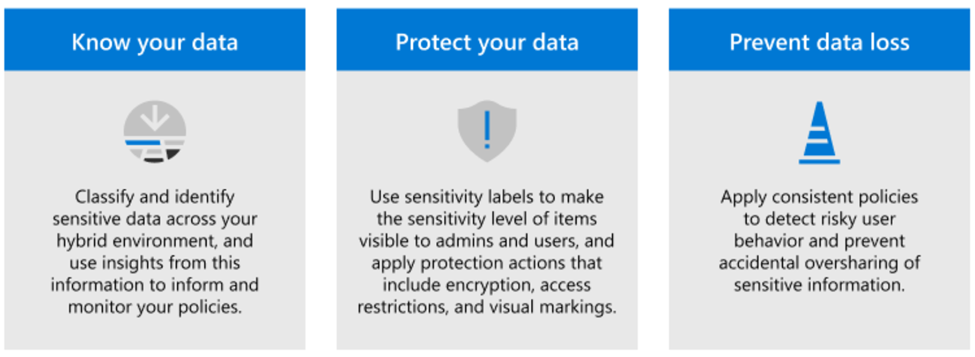
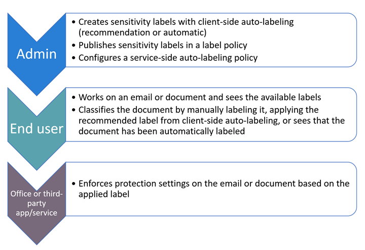
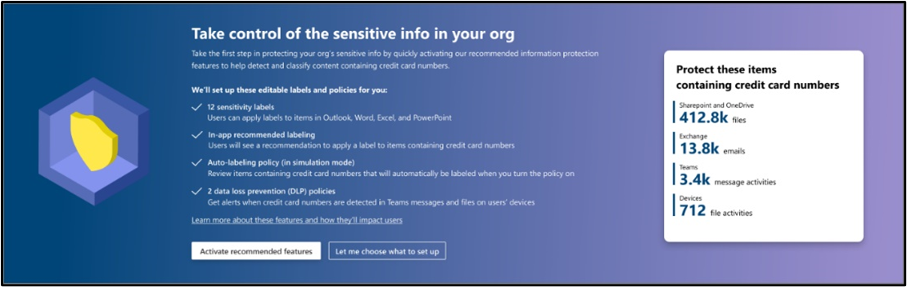
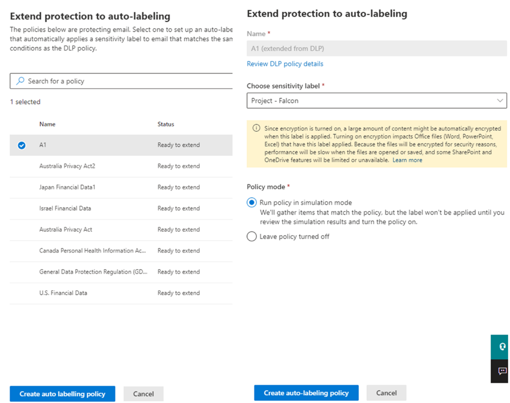
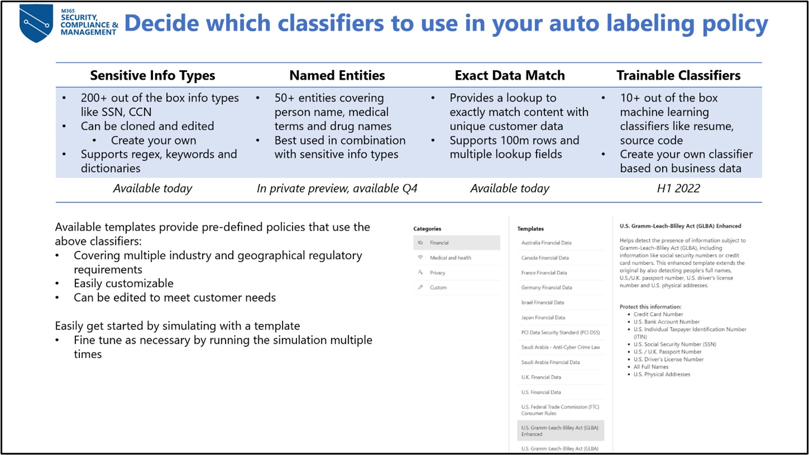
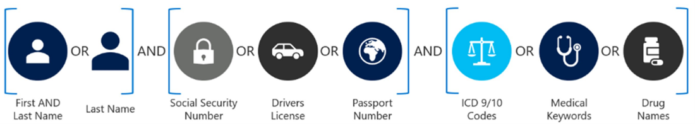
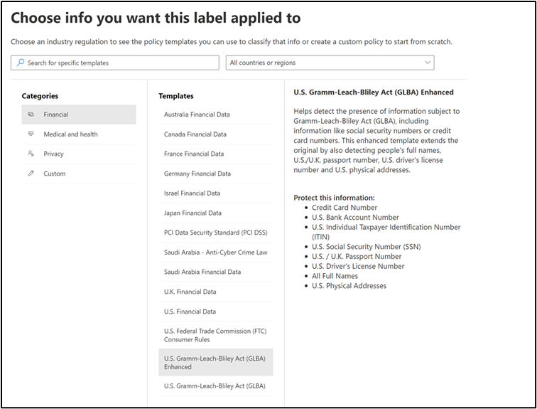
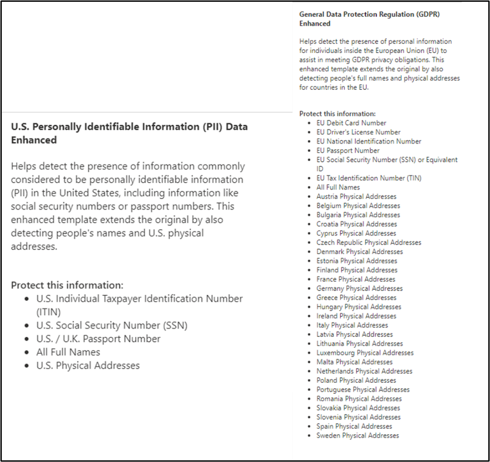
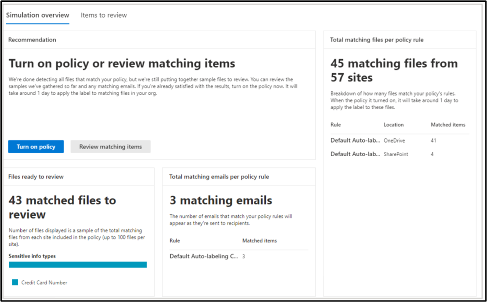
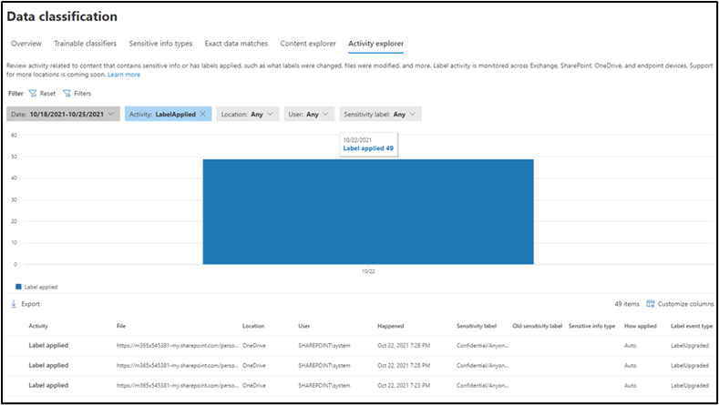

# Service side auto labeling playbook

## Introduction
Microsoft Information Protection (MIP) is a built-in, intelligent, unified, and extensible solution to protect sensitive data across your enterprise – in Microsoft 365 cloud services, on-premises, third-party SaaS applications, and more. MIP provides a unified set of capabilities to know your data, protect your data, and protect against data loss across Microsoft 365 apps (e.g., Word, PowerPoint, Excel, Outlook) and services (e.g., Microsoft Teams, SharePoint, and Exchange).

<figure>
     
    <figcaption>Figure 1: Microsoft Information Protection Cycle</figcaption>
</figure>

Some of the key MIP capabilities include Sensitive information types (SIT), Trainable classifiers, Data classification, Sensitivity labels, Data loss prevention, Endpoint data loss prevention etc. 
For more info: [Microsoft Information Protection in Microsoft 365 - Microsoft 365 Compliance | Microsoft Docs](https://docs.microsoft.com/en-us/microsoft-365/compliance/information-protection?view=o365-worldwide)

## MIP Overview 
The foundation of MIP is the ability to classify data by our Data Classification Service, please see the MIP constellation below to view how the MIP functionalities all work together.  

<figure>
     
    <figcaption>Figure 2: Microsoft Information Protection Architecture</figcaption>
</figure>

Identifying and classifying sensitive items that are under your organization's control is the first step in the Information Protection discipline. Foundational to Microsoft are its classification capabilities—from out-of-the-box sensitive information types to machine learning trainable classifiers to automatically finding and classifying sensitive content at scale. Sensitive Information Types are pattern-based classifiers which detect sensitive information like social security, credit card or bank account numbers within a tenant, and help customers to identify, evaluate, and protect their data. Data Classification Service and specifically Sensitive Information Types allow customers to define and identify what information is considered sensitive in their environments. They are utilized by various Microsoft 365 Compliance related features including, but not limited to: Data Loss Prevention, Communication Compliance, Insider Risk Management, Auto-Labeling, Retention, and Sensitivity Labels. 
We announced several key enhancements to the intelligence and built-in capabilities of MIP across Microsoft 365 applications and services. These capabilities help organizations reduce the number of false positives as they accurately classify ever-increasing amounts of data. These capabilities also increase the coverage of classified data as they go across Microsoft 365 services and workloads.
For more info: [Microsoft Information Protection: Announcing Enhanced Automatic Classification Capabilities! - Microsoft Tech Community](https://techcommunity.microsoft.com/t5/security-compliance-and-identity/microsoft-information-protection-announcing-enhanced-automatic/ba-p/2871144).

Per the scope of this playbook, we’ll focus on auto-labeling overview with some basic understanding of the capabilities:
Sensitivity labels are at their basic level a tag, that is customizable, persistent, accessible to applications, and visible to users. Labels once applied to documents and email become the basis for enforcing data protection policies throughout the tenants’ digital estate. When a label is applied to a file or email it is persisted as document metadata. When a label is applied to a SharePoint site or OneDrive for business the label persists as container metadata.

## Auto-Labeling Overview
There are multiple methods for automatically applying a label to emails and documents based on their content in Microsoft 365, two of the key ones are:

**Client-side auto-labeling:** Client-side auto-labeling happens on the client workstation as the user creates or edits a document or email using Word, Excel, PowerPoint, and Outlook. Depending on the content detected, the label is applied automatically or recommended to the users based on the properties of the label. A default label can also be assigned to documents. This form of client-side labeling does not evaluate document content based on conditions defined on a global policy, but it is based on properties defined for each label. It's important to understand that auto-labeling is supported in various degrees by both the Azure Information Protection Unified Labeling client as well as the Microsoft 365 apps for Enterprises (built-in support). 

**Service-side auto-labeling:** Service-side auto-labeling is sometimes referred to as *auto-labeling for data at rest and data in transit*. Unlike client-side auto-labeling, service side auto labeling does not depend on the client to analyze the document content while it is being created. Instead, service-side auto-labeling reviews content that is stored (at-rest) in SharePoint or OneDrive document libraries, or that is "in-flight". For instance, when a message is submitted to transport. All policy review and application are done within the service. Service-side auto-labeling policies are created and configured from the Information Protection section of the Compliance Center under the Auto-labeling policy tab. Auto-labeling policies don't support recommended labeling because the user doesn't interact with the labeling process. Instead, the administrator runs the policies in simulation mode to help ensure the correct labeling of content before applying the label. 
The table below provides a comparison of Service-side, Client-side, and Defender for cloud apps auto-labeling solutions and can help you identify when a particular solution is appropriate for labeling needs.

|  Capability  |  Service side  |  Client side  |  Defender for cloud apps (MCAS)  |
|---|---|---|---|
|  **Application support**  |  SharePoint, OneDrive and Exchange Online  |  Word, PowerPoint, Excel or Outlook Microsoft 365 apps, or AIP plugin for Office  |  SharePoint, OneDrive and third-party services supported by Defender for cloud apps  |
| **File types supported**  |  .docx, .xlsx, .pptx and related formats  |  .docx, .xlsx, .pptx and related formats  |  .docx, .xlsx, .pptx and related formats, PDF  |
| **File types supported**  |  .docx, .xlsx, .pptx and related formats  |  .docx, .xlsx, .pptx and related formats  |  .docx, .xlsx, .pptx and related formats, PDF  |
| **File types supported**  |  .docx, .xlsx, .pptx and related formats  |  .docx, .xlsx, .pptx and related formats  |  .docx, .xlsx, .pptx and related formats, PDF  |
| **File types supported**  |  .docx, .xlsx, .pptx and related formats  |  .docx, .xlsx, .pptx and related formats  |  .docx, .xlsx, .pptx and related formats, PDF  |
| **File types supported**  |  .docx, .xlsx, .pptx and related formats  |  .docx, .xlsx, .pptx and related formats  |  .docx, .xlsx, .pptx and related formats, PDF  |

In addition, label priority is used in determining when and how an auto-label will be applied. The following table lists some common labeling scenarios, the label setting (i.e., auto or recommended label) and the expected outcome or behavior. 

|  Scenario  |  Label Setting  |  Behavior  |
|---|---|---|
|  **Content has no label**  |  Client-side recommendation  |  Recommend new label  |
| |  Client-side auto labeling  |  Apply new label  |
| |  Service-side auto labeling  |  Apply new label  |
|  **Label manually applied**  |  Client-side recommendation  |  Recommend new label if higher sensitivity  |
| |  Client-side auto labeling  |  No action. Manually applied label takes precedence  |
| |  Service-side auto labeling  |  No action. Manually applied label takes precedence  |
|  **Default label applied (Label policy)**  |  Client-side recommendation  |  Recommend new label if higher sensitivity  |
| |  Client-side auto labeling  |  Apply new label if higher sensitivity  | 
| |  Service-side auto labeling  |  Apply new label if higher sensitivity  |
|  **Auto label aplied**  |  Client-side recommendation  |  Recommend new label if higher sensitivity  |
| |  Client-side auto labeling  |  Apply new label if higher sensitivity  | 
| |  Service-side auto labeling  |  Apply new label if higher sensitivity  |

## Licensing Requirements
To understand your licensing requirements and options for MIP, see the Information Protection section from the [Microsoft 365 licensing documentation](https://docs.microsoft.com/en-us/office365/servicedescriptions/microsoft-365-service-descriptions/microsoft-365-tenantlevel-services-licensing-guidance/microsoft-365-security-compliance-licensing-guidance#information-protection-sensitivity-labeling). Below is the sensitivity labeling licensing info for your quick reference, however, we encourage you to reference the M365 licensing documentation for up-to-date information.

For **manual sensitivity labeling**, the following licenses provide user rights:

* Microsoft 365 E5/A5/G5/E3/A3/G3/F1/F3/Business Premium

* Enterprise Mobility + Security E3/E5

* Office 365 E5/A5/E3/A3/F3

* AIP Plan 1

* AIP Plan 2

For both **client and service-side automatic sensitivity labeling**, the following licenses provide user rights:
* Microsoft 365 E5/A5/G5
* F5 Compliance
* F5 Security & Compliance
* Microsoft 365 E5/A5/G5 Information Protection and Governance
* Office 365 E5

For **client-side automatic sensitivity labeling only**, the following license provides user rights:
* Enterprise Mobility + Security E5/A5/G5
* AIP Plan 2

To **apply and view sensitivity labels in Power BI and to protect data when it's exported from Power BI to Excel, PowerPoint, or PDF**, the following licenses provide user rights:
* Microsoft 365 E5/A5/G5/E3/A3/G3/F1/F3/Business Premium
* Enterprise Mobility + Security E3/E5
* AIP Plan 1
* AIP Plan 2
	
Note: G3 and G5 are the Office 365 services/plans for Government organizations.
For feature-level licensing requirements please refer to [Licensing PDF file](https://go.microsoft.com/fwlink/?linkid=2139145).

## Role Requirements
Sensitivity labels from the MIP solution let you classify and protect your organization's data, while making sure that user productivity and their ability to collaborate isn't hindered. Members of your compliance team who will create sensitivity labels need permissions to the Microsoft 365 compliance center.
By default, **Global Administrators** for your tenant have access to this admin center and can give compliance officers and other people access, without giving them all the permissions of a tenant admin. For this delegated limited admin access, add users to the **Compliance Data Administrator, Compliance Administrator, or Security Administrator** role group.
Alternatively, using the default roles, you can create a new role group and add either **Sensitivity Label Administrator or Organization Configuration** roles to this group. For a read-only role, use **Sensitivity Label Reader**.
These permissions are required only to create and configure sensitivity labels and their label policies. They are not required to apply the labels in apps or services. If additional permissions are needed for specific configurations that relate to sensitivity labels, those permissions will be listed in their respective documentation instructions.
To be able to review matched items we find while in simulation mode (process before deployment that allows you to verify what items we will help you label if you turn on the policy), make sure you have the following permissions:
* **Content Explorer List viewer:** Membership in this role group allows you to see each item and its location in list view. The data classification list viewer role has been pre-assigned to this role group.
* **Content Explorer Content viewer:** Membership in this role group allows you to view the contents of each item in the list. The data classification content viewer role has been pre-assigned to this role group.
For instructions to add users to the default roles or create your own role groups, see [Permissions in the Microsoft 365 compliance center](https://docs.microsoft.com/en-us/microsoft-365/compliance/microsoft-365-compliance-center-permissions?view=o365-worldwide).

The basic flow for deploying and applying sensitivity labels:

<figure>
     
    <figcaption>Figure 3:Service side auto labeling</figcaption>
</figure>

## MIP Service Auto-Labeling in depth
Auto labeling is a built-in Microsoft service that triggers off sensitive content found in files in SharePoint Online, OneDrive for Business and emails in Exchange Online. Define what sensitive information you want us to protect using regulatory templates, 200+ out of box sensitive info or custom types, named entities, Exact Data Match and ML models in an auto labeling policy. We will simulate what files are detected that match your auto-labeling policy in our simulation mode, so you can review and be confident in our matches before agreeing to allow us to automatically label those documents.

## Protecting Sensitive Information in SharePoint/OneDrive
Sensitive files are automatically detected and labeled at rest.

- Office files for Word (.docx), PowerPoint (.pptx), and Excel (.xlsx) are supported.
 
	- These files can be auto-labeled at rest before or after the auto-labeling policies are created. Files cannot be auto-labeled if they are part of an open session (the file is open).
    
 	- Currently, attachments to list items aren't supported and won't be auto-labeled.

- Maximum of 25,000 automatically labeled files in your tenant per day.

- Maximum of 100 auto-labeling policies per tenant, each targeting up to 100 sites (SharePoint or OneDrive) when they are specified individually. You can also specify all sites, and this configuration is exempt from the 100 sites maximum.

- Existing values for modified, modified by, and the date are not changed as a result of auto-labeling policies—for both simulation mode and when labels are applied.

- When the label applies encryption, the [Rights Management issuer and Rights Management owner](https://docs.microsoft.com/en-us/azure/information-protection/configure-usage-rights#rights-management-issuer-and-rights-management-owner) is the account that last modified the file. If this account is no longer in Azure Active Directory, the label won't be applied because these values can't be set.

## Protecting Sensitive Information inExchange
Sensitive emails are automatically detected and labeled in transit/ as they are sent. For Exchange, it does not include emails at rest (mailboxes).
Note: emails detected in simulation mode will not be labeled when the policy is turned on, as we only label emails in transit and those emails were sent before the policy was enforced. 
* Unlike manual labeling or auto-labeling with Office apps, PDF attachments as well as Office attachments are also scanned for the conditions you specify in your auto-labeling policy. When there is a match, the email is labeled but not the attachment.
    - For PDF files, if the label applies encryption, these files are encrypted by using [Office 365 Message Encryption (OME)](https://docs.microsoft.com/en-us/microsoft-365/compliance/ome?view=o365-worldwide) when your tenant is [enabled for PDF attachments](https://docs.microsoft.com/en-us/microsoft-365/compliance/ome-faq?view=o365-worldwide#are-pdf-file-attachments-supported-).
    - For these Office files, Word, PowerPoint, and Excel are supported. If the label applies encryption, they are encrypted by using [Office 365 Message Encryption (OME)](https://docs.microsoft.com/en-us/microsoft-365/compliance/ome?view=o365-worldwide).
* If you have Exchange mail flow rules or data loss prevention (DLP) policies that apply IRM encryption: When content is identified by these rules or policies and an auto-labeling policy, the label is applied. If that label applies encryption, the IRM settings from the Exchange mail flow rules or DLP policies are ignored. However, if that label doesn't apply encryption, the IRM settings from the mail flow rules or DLP policies are applied in addition to the label.
* Email that has IRM encryption with no label will be replaced by a label with any encryption settings when there is a match by using auto-labeling.
* Incoming email is labeled when there is a match with your auto-labeling conditions:
* If the label is configured for [encryption](https://docs.microsoft.com/en-us/microsoft-365/compliance/encryption-sensitivity-labels?view=o365-worldwide), that encryption isn't applied.
* If the label is configured to apply [dynamic markings](https://docs.microsoft.com/en-us/microsoft-365/compliance/sensitivity-labels-office-apps?view=o365-worldwide#dynamic-markings-with-variables), be aware that this configuration can result in the names of people outside your organization.
* When the label applies encryption, the [Rights Management issuer and Rights Management owner](https://docs.microsoft.com/en-us/azure/information-protection/configure-usage-rights#rights-management-issuer-and-rights-management-owner) is the person who sends the email. There currently isn't a way to set a Rights Manager owner for all incoming email messages that are automatically encrypted.

## Requirements for  configuring MIP Auto-labeling
* Simulation mode:
    - Auditing for Microsoft 365 must be turned on. If you need to turn on auditing or you're not sure whether auditing is already on, see [Turn audit log search on or off](https://docs.microsoft.com/en-us/microsoft-365/compliance/turn-audit-log-search-on-or-off?view=o365-worldwide).
* To auto-label files in SharePoint and OneDrive:
    - You have [enabled sensitivity labels for Office files in SharePoint and OneDrive](https://docs.microsoft.com/en-us/microsoft-365/compliance/sensitivity-labels-sharepoint-onedrive-files?view=o365-worldwide).
    - At the time the auto-labeling policy runs, the file mustn't be open by another process or user. A file that's checked out for editing falls into this category.
* If you plan to use [custom sensitive information types](https://docs.microsoft.com/en-us/microsoft-365/compliance/sensitive-information-type-learn-about?view=o365-worldwide) rather than the built-in sensitivity types:
    - Custom sensitivity information types apply only to content that is added or modified in SharePoint or OneDrive after the custom sensitivity information types are created.
    - To test new custom sensitive information types, create them before you create your auto-labeling policy, and then create new documents with sample data for testing.

## Step 1: Create and publish sensitivity labels
* One or more sensitivity labels [created and published](https://docs.microsoft.com/en-us/microsoft-365/compliance/create-sensitivity-labels?view=o365-worldwide) (to at least one user) that you can select for your auto-labeling policies. For these labels:
    - It does not matter if the auto-labeling in Office apps label setting is turned on or off, because that label setting supplements auto-labeling policies
    - If the labels you want to use for auto-labeling are configured to use visual markings (headers, footers, watermarks), note that these are not applied to documents.
    - If the labels apply [encryption](https://docs.microsoft.com/en-us/microsoft-365/compliance/encryption-sensitivity-labels?view=o365-worldwide):
	    - When the auto-labeling policy includes locations for SharePoint or OneDrive, the label must be configured for the **Assign permissions now** setting.
	    - When the auto-labeling policy is just for Exchange, the label can be configured for either **Assign permissions now** or **Let users assign permissions** (for the Do Not Forward or Encrypt-Only options).
* We recommend that you have your label taxonomy and hierarchy defined in a label policy applied to all users to help them get started with manual labeling from the information worker side. 
    - In defining your labels, you can set up in-app auto-labeling recommendations, where you define what sensitive information you are concerned about, and information workers will see a banner that says that recommends them to label this document with that label if your defined sensitive information is found in the document they are working with. 
    - You can define a default label in your label policy that is automatically applied to files and emails in use that have not been manually labeled. 
You can easily get started with all things labeling by using our easy set-up of default label schema, label policy, and auto-labeling policy. 
1.	In the [Microsoft 365 compliance center](https://go.microsoft.com/fwlink/p/?linkid=2077149), navigate to sensitivity labels:
    - **Solutions** > **Information protection**
If you don't immediately see this option, first select **Show all**.
2.	In the **Overview** tab you should see the following banner:

<figure>
     
    <figcaption>Figure 2: Banner</figcaption>
</figure>

**Activate recommended features** to set up our default policy configurations designed to protect credit card numbers. 
You will only see this option if you have not set up labeling, in-app labeling recommendation, auto-labeling policy, Teams DLP, or DLP for devices. If you have already set up an auto-labeling policy, you will not be shown this banner but can configure our default auto-labeling policy on your own
[Learn about the default labels and policies for Microsoft Information Protection - Microsoft 365 Compliance | Microsoft Docs](https://docs.microsoft.com/en-us/microsoft-365/compliance/mip-easy-trials?view=o365-worldwide#service-side-auto-labeling)

## Step 2: Create an auto-abeling policy
### Get started with auto-labeling with our default auto-labeling policy protecting credit card numbers on SharePoint, OneDrive, and Exchange
If you already have your labels set up but have not create any auto-labeling policies;
In the [Microsoft 365 compliance center](https://go.microsoft.com/fwlink/p/?linkid=2077149), navigate to sensitivity labels:
    - Solutions > Information protection 
If you don't immediately see this option, first select **Show all**.
In the **Overview** tab you should see the following banner:

<figure>
     
    <figcaption>Figure 2: Banner</figcaption>
</figure>

**Activate recommended features** to set up our default policy configurations designed to 	protect credit card numbers. 
You will be asked to pick two of your existing labels to use in the auto-labeling policy in 	simulation mode. We recommend using a “Confidential” like sublabel for both, with the 	higher count auto-labeling credit card policy having more protections than the low count. 
If you have already set up an auto-labeling policy, you will not be shown this banner but can configure our default auto-labeling policy on your own
[Learn about the default labels and policies for Microsoft Information Protection - Microsoft 	365 Compliance | Microsoft Docs](https://docs.microsoft.com/en-us/microsoft-365/compliance/mip-easy-trials?view=o365-worldwide#service-side-auto-labeling).

### Extend DLP policies covering Exchange to auto-labeling 
In the [Microsoft 365 compliance center](https://go.microsoft.com/fwlink/p/?linkid=2077149), navigate to sensitivity labels:
    - **Solutions** > **Data Loss Prevention** 
If you don't immediately see this option, first select **Show all**.
In the **Overview** tab you should see the following banner:

<figure>
     
    <figcaption>Figure 2: Banner</figcaption>
</figure>

Extend your Exchange DLP policy to an auto-labeling policy in simulation mode.

<figure>
     
    <figcaption>Figure 2: Banner</figcaption>
</figure>

### Create your own auto-labeling policy

<figure>
     
    <figcaption>Figure 2: Banner</figcaption>
</figure>

You want to protect the sensitive data in your organization. What is sensitive in your organization? Start with our sensitive information types. We have 200+ out of the box sensitive information types that we help detect in your organization. Check content explorer to see which sensitive information types we are finding. 
So, what information is there? Do you detect a lot of sensitive information that needs to be protected with labeling?
If you are unsure of what data to protect or how to get started, look at our provided Financial, Medical and Health, and Privacy templates. These provide a great baseline of sensitive information types to protect given different regulations and industries. You can customize these templates to add more sensitive information types you are concerned with.
Named entities recognition (NER), which is something we are doing right now in private preview, allows you to be able to identify entities like physical address, names, and more with other sensitive information types to be more confident that it is something you are looking for. This works great to reduce false positives.
As you get more advanced or have more business use cases, you can also explore things like exact data matching which looks at your specific customer data that you are passing in detects and labels for this customer's information. This is a more complex process that requires more time to configure and execute but can bring your false positive rates to near zero allowing you to be more assertive with auto-labeling policies. 

Another option is trainable classifiers where we use machine learning, to understand what content in your organization looks like from business files like resumes to source code and protect that information.
These different classifier types are not mutually exclusive to each other. You can and in fact we encourage you to try out combinations of different types of classifiers. For example, you can use a sensitive information type (SIT) for PII together with named entity recognition for person's names in a policy trying to detect large amounts of identity information in a table, or you can use trainable classifiers together with a custom SIT to detect invoices above a certain amount. You can also use EDM as an exclusion to a rule based on a regular SIT to avoid identifying employee PII as potential customer PII, etc.

Pick your scope
* Option 1: ALL – SharePoint sites, OneDrive accounts and Email users
* Option 2: Subset of sites or accounts – can use PowerShell for longer lists
* *Roadmap*: We are working to support OneDrive groups 
Select a label to use for auto-labeling
* This label will not go into effect until you turn on your policy from simulation mode.
* You can always simulate the policy. Check the matches, and then go back and edit the label used for the policy. 
* The protections of the label you select will then apply to every document automatically labeled. 

## Step 5: Simulate
After 12 hours, you can analyze the results of our auto-labeling simulation. You will be shown files and emails that match your auto-labeling policy configurations that would be labeled if your policy was turned on. Review these matches to make sure they match with what you are expecting. 

## Step 6: Refine Policy 
If you are seeing high amounts of false positives, fine-tune your policy with the following recommendations:
* Increase the thresholds of sensitive information types found to determine severity
    - It is okay to use different thresholds for individual classifiers
* Understand confidence levels and how they are defined
    - Low confidence may be good!
    - Try using a low confidence with high threshold or a higher confidence level
* Group like information types together 
    - Combine multiple SITs to detect combinations that matter (e.g. a Social Security Number on its own may not be relevant without a person associated, but an SSN together with an account number, a person's name or a medical condition may be).
    - Switch from looking for “Any of these” to “All of these”
* Use Boolean operators to combine groups
    - Look for SSN AND Driver’s License instead of SSN OR driver’s License 

<figure>
     
    <figcaption>Figure 2: Banner</figcaption>
</figure>

More advanced refinement strategies if the above don’t work:
* Switch this policy to be for client-side auto labeling, since false positives are much less problematic with client-side since the user can take care of the "mistake" with one click
* Use EDM to eliminate false positives by matching only known sensitive information (ex. actual customer PII)
* Clone and modify the built-in SITs to include additional conditions, such as keywords, more stringent matching of values or stronger formatting requirements. 
* Modify a custom SIT to exclude known prefixes, suffixes or patterns. For example, a custom SIT to detect phone numbers might trigger for every email if your email signatures or document headers include your offices phone numbers. Excluding the sequences common to your company's phones as prefixes to your custom SIT can prevent the rule from triggering for every email or document. 
* Include additional dictionary-based SITs as conditions to narrow down the matches to those that talk about the relevant topics. ex. a rule for matching patient diagnostics may be enhanced by requiring the presence of words like diagnostic, diagnosis, condition, symptom, patient, etc.

## Step 7: Enforce
When you are confident in the matches you see in simulation, turn on your policy from simulation mode so that we can start auto labeling the files and emails in your organization. 
You can see what’s getting labeled through activity explorer. 

## Auto labeling use cases from our customers
### Scenario 1: Protecting payment information of customers
A lot of customers have an interest in protecting their financial data surrounding payment data to comply with financial regulations. This usually entails a combination of bank account numbers, PII (Personal Identifiable Information) of customers, credit card numbers and account information. 

<figure>
     
    <figcaption>Figure 2: Banner</figcaption>
</figure>

Recommendation:
* Use our U.S. Gramm-Leach Bliley Act (GLBA) Enhanced template
* On ALL locations (SharePoint, OneDrive, Exchange)
* Label guidance on which to apply:
    - Label published to all users
    - Confidential Label Priority (2nd highest parent label)
    - Internal Only

### Scenario 2: Complying with HIPPA regulations on health care data
Another field that we’ve seen a lot of interest in protecting is health care data information to comply with HIPPA regulations.

<figure>
     
    <figcaption>Figure 2: Banner</figcaption>
</figure>

Recommendation:
* Use our U.S. Health Insurance Act (HIPPA) Enhanced template
* On ALL locations (SharePoint, OneDrive, Exchange)
* Label guidance on which to apply:
    - Label published to all users
    - Confidential Label Priority (2nd highest parent label)
    - Internal Only

### Scenario 3: Protecting personal data
Similarly, we have seen an interest in protecting the personal data of both customers and employees. We have auto-labeling templates to protect U.S. Personally Identifiable Information (PII) Data, General Data Protection Regulation (GDPR), and more.

<figure>
     
    <figcaption>Figure 2: Banner</figcaption>
</figure>

Recommendation:
* Use our U.S. PII Data Enhanced or GDPR Enhanced template
* On ALL locations (SharePoint, OneDrive, Exchange)
* Label guidance on which to apply:
    - Label published to all users
    - Confidential Label Priority (2nd highest parent label)
    - Internal Only
Advanced Scenario:
* Using EDM to identify patient healthcare data 

## Reports
Simulation results showing number of files and emails matched in how which locations are available when you click on the auto-labeling policy for more details.

<figure>
     
    <figcaption>Figure 2: Banner</figcaption>
</figure>

After an auto-labeling policy is enabled, you can view the labeling activity in Activity Explorer. 

<figure>
     
    <figcaption>Figure 2: Banner</figcaption>
</figure>

## Implementation Strategy
If you do not have labels set up yet:

* [Set up all things labeling with our default policies and configurations](#step-1-create-and-publish-sensitivity-labels)
If you have labels, and an Exchange DLP policy

* **Extend your Exchange DLP policy to auto-labeling - Need section reference here**
If you have client-side auto-labeling set up, but no service side auto-labeling policy

* Use client-side auto labeling or recommendations and service-side auto labeling in combination, with the same conditions but with different thresholds, ex. use high confidence matches for service-side auto labeling and use low or medium confidence for a client-side recommendation, which gives the user an option to dismiss the label if it isn't appropriate for the content and apply a different label.

If you have labels set up, but no service side auto-labeling policy

1. **Get started with auto-labeling with our default auto-labeling policy - Need section reference here**

1. Create custom auto-labeling policy using a template (**see scenarios above - Need section reference here**)

1. Create auto labeling policies that trigger for different confidence levels of the SITs with different counts (ex. one high confidence count or multiple medium confidence count) to avoid false positives without risking leakage of large amounts of sensitive data that may not meet the most stringent conditions of higher confidence.
Use content explorer to understand where data is present that may need to be included in an auto-labeling policy. 

## FAQ
How should I finetune for false positives?
* Increase the thresholds of sensitive information types found to determine severity
    - It is okay to use different thresholds for individual classifiers
* Understand confidence levels and how they are defined
    - Low confidence may be good!
    - Try using a low confidence with high threshold or a higher confidence level
* Group like information types together 
    - Switch from looking for “Any of these” to “All of these”
* Use Boolean operators to combine groups
    - Look for SSN AND Driver’s License instead of SSN OR driver’s License 

<figure>
     
    <figcaption>Figure 2: Banner</figcaption>
</figure>

-	Advanced method: use Exact Data Matching to only look for a specific set of data like your specific customer information (this is a more complex process that takes time to configure)
What do I do if I have over 1 million matched files and cannot enforce my auto-labeling policy?

-	Since we have a limit of 25,000 files being labeled a day on SharePoint/OneDrive, we want to make sure it does not take us that long to label all the matches from your policy.

-	First check to make sure all the matches are accurate. If not, please finetune the policy for false positives. 

-	If the matches all look accurate but the matches still exceed 1 million, scope your policies to a smaller subset of locations first and enforce that policy. Then go in and create another identical policy scoped to the remaining locations.
How does changing label protections affect auto-labeling?

-	For SharePoint and OneDrive, when a file is open, we retrieve the updated protection actions of the labels. Therefore, any updates to the label protections will be reflected on the document the next time it is opened.

-	For Exchange, emails are stamped with the label and associated protections at the time of the email being sent. If a label protection is modified, previously labeled emails with that label will retain the old permissions, but any new emails sent will have the new label protections. 

### What happens if I need to change my label schema after enforcing an auto-labeling policy?

We recommend that you have your established label schema in place before continuing to auto-labeling, but understand that sometimes minds change and revisions are needed.

1.	Decide what your new label schema is

1.	Create the new label schema. Edit existing labels if possible to fit the new label hierarchy, but do not delete any old labels yet.

1.	Determine if the label you used for auto-labeling is still appropriate?
	
	1.	If so, you are all set.
	
	1.	If not, determine the replacement label you would like to use.
		
		1.	Make sure the replacement label has a higher label priority than the original label. 
	
		1. 	Edit the auto-labeling policy to use the new label with higher label priority
		
		1.	Simulate the policy
		
		1.	Enforce the policy
		
		1.	Delete original label if no longer part of your new label schema

### What is simulation mode?

-	Simulation mode is a process between configuring the policy and enforcing it. It allows you to see what matches we find that match your policy configuration that will be labeled if you enforced your policy. No labeling is done in simulation mode. It serves as an reassurance assessment of our sensitive information type detection before we apply any labels for you automatically. 
What happens when I turn on a policy?

-	Files and emails will start getting labeled according to your auto-labeling policy. You can view what is being labeled in activity explorer.

-	We have a limit of 25,000 files being labeled a day on SharePoint/OneDrive, so labeling might span the course of several days depending on how many matched files we found in simulation mode.

## Abbreviations
* MIP = Microsoft Information Protection
* SPO = SharePoint Online
* ODB = OneDrive for Business
* EXO = Exchange Online 
* SIT = Sensitive Information Type
* NER = named entity recognition
* EDM = exact data match
* PII = Personally Identifiable Information
* TC = trainable classifiers
