# Protecting your organization’s Source Code and Product Development Files with Purview Data Loss Prevention

Source code and product development files are the top Intellectual property and trade secrets for many organizations. This exposes them to a wide range of data leakages and exfiltration and many of these leakages are blind spots to organizations
Common data protection risks with Source Code include 
-	downloading source code and related IP to vulnerable Endpoints where the sensitive info may become a target for attackers or even insiders for misuse. 
-	Embedding portions of source code in office documents (similar to obfuscation) and sharing externally to unauthorized clouds/users. 
-	Sending Source code files to personal email. This typically happens with temporary employees
This quick handbook describes, how you can use advanced classification + DLP capabilities of M365 Purview to detect and protect your organization’s source code and IP from various risks
Purview’s data classification suite includes Trainable Classifier to address this specific scenario. This combined with DLP capabilities which include Endpoint DLP can mitigate the top risks across your data estate.

<figure>
    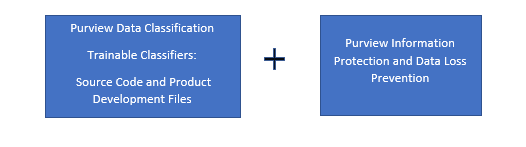 
</figure>
<figure>
     
     <figcaption>Figure 1: Microsoft Information Protection Cycle</figcaption>
</figure>

**Know your data** assists in understanding the current data landscape and provides organizations with the ability to identify sensitive content residing in Microsoft 365 across Exchange, SharePoint, OneDrive for Business, and physical devices depending on workloads used and licensing owned.
**Protecting your data** assists in applying flexible protection that includes visual marking, encryption and access restrictions across apps, services and devices that travel inside and outside the organization.
**Prevent data loss (DLP)** assists in preventing accidental data loss and oversharing of sensitive information within or outside the organization. In the Data Loss Prevention capability of MIP, Global and Compliance admins can create policies across workloads and apply rules to protect data oversharing. Pre-defined built in regulatory templates across various industries are available. Administrators can also create their own custom policies to suit organizational needs.

## Trainable Classifiers
A Classifier is a special tag/label which uses Machine Learning to identify documents of a specific type of content by following an automated logic. Machine Learning uses some sample (seed) documents to learn and create the logic for identifying documents. Trainable classifiers are built using large numbers of sample data to meet high levels of accuracy thresholds.

# Classifiers for detecting Source Code and Intellectual Property

To address the risks related to exfiltration of Source Code and related IP, we have built two out-of-box, ready-to-use classifiers
1.	*Source Code* – built to detect a wide range of primary programming languages such as …. primary programming languages and …….other scripting languages and can detect upto 20% partial code or 20 lines of embedded code. Additional, this new source code model can also support office file extensions: docx, docm, doc, dotx, dotm, dot, pdf, txt, one, eml, msg for enhanced detection

2.	*Product Development Files* – can detect common content/files used for developing features and applications and includes product requirements documents, product testing documents, UI/UX specifications and relating content

# How do you use these classifiers to protect source code and product dev files?

*Scenario 1: Discover sensitive source code content across the digital estate*
You can use Content Explorer to discover all data in One Drive, Sharepoint and Teams that matches these classifiers.  
For each classifier, the location to the specific document can be drilled down that has been classified. If the classification is not what is expected, there is an opportunity to provide No-Match feedback so that we can further improve the classifiers
<figure>
     
</figure>
Click on the tab “Trainable Classifiers” for the discovery and classification of sensitive information across SPO and ODB by clicking on the respective classifier/category in Content Explorer .  

<figure>
     
</figure>
<figure>
     
</figure>
<figure>
    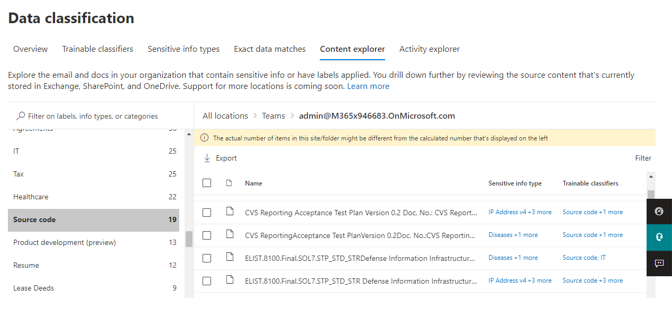 
</figure>

*Scenario 2: Prevent sharing of Source Code and product dev files using Purview DLP* 
Trainable classifiers can be added as a condition for data loss prevention (DLP) policies across Exchange, Teams, Endpoint, Sharepoint and Onedrive. Additionally, all activity corresponding to these DLP policies/rules can be viewed in Activity Explorer and the alerts can be investigated in the using the Alerts tab or M365 incident management portal

*Scenario 3: Auto-apply sensitivity labels and/or encrypt sensitive source code content within documents.*
These Trainable Classifiers can now be added as condition to servers-side auto-labeling policies for Exchange, Sharepoint and One-drive. The policies once created can be evaluated using the Simulation mode to view and review the matched items. Once the simulation is complete, there is an option to add more content for simulation of turn-on the policies  

## Step-by-step detailed guidance for discovering and protecting sensitive content with Purview MIP and DLP

## Licensing Requirements
Trainable Classifiers are available with an E5 License. 
## Role Requirements
To create DLP policies or rules in the Microsoft 365 Compliance Center (MCC), the user should have a role of Information Protection Admins, Global Admin, Compliance Admin, or Compliance Data Admin. 
The Content Explorer Content Viewer role is required to view Content Explorer or Activity Explorer. 

To view the data visualization in the Data Classification module, there are two roles that grant access to content explorer RBAC (Use role-based access control to grant fine-grained access to Microsoft 365 Defender portal | Microsoft Docs):

Content Explorer List viewer: Membership in this role group allows you to see each item and its location in list view. The data classification list viewer role has been pre-assigned to this role group. 
Content Explorer Content viewer: Membership in this role group allows you to view the contents of each item in the list. The data classification content viewer role has been pre-assigned to this role group.

# Configuring and deploying DLP Policies for Source Code
*Step 1: Create DLP (Data Loss Prevention) Policy*
Data Loss Prevention overview provides the overall summary of the total number of activities detected across various locations such as OneDrive, SharePoint, Exchange, Teams, etc. It has presence of different tabs such as Policies (to create any new policy or edit the previous one), alerts, Endpoint DLP settings, and activity explorer (total number of DLP rule matched, labels applied, auto-labeling simulation, etc.)
<figure>
    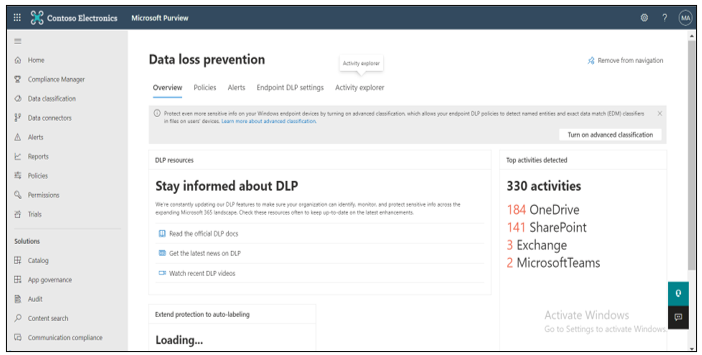 
</figure>
*Step 2: Add Trainable Classifier as a condition*
In DLP platform, under policy tab, a new DLP Policy can be created with the existing templates or the custom policy. In this, policy can be applied to different locations such as SharePoint, OneDrive, Exchange etc. A rule is created with trainable classifiers as a condition along with email alerts, actions to be taken, and policy tips.
<figure>
     
</figure>
<figure>
     
</figure>
<figure>
    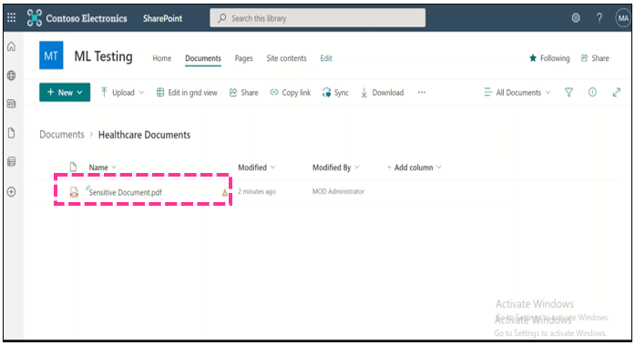 
</figure>

*Step 3: Apply DLP Policy*
Policy Tip: In the SharePoint, once the sensitive document is uploaded, the DLP policy is triggered, and a policy tip is displayed against each of the sensitive document.

<figure>
    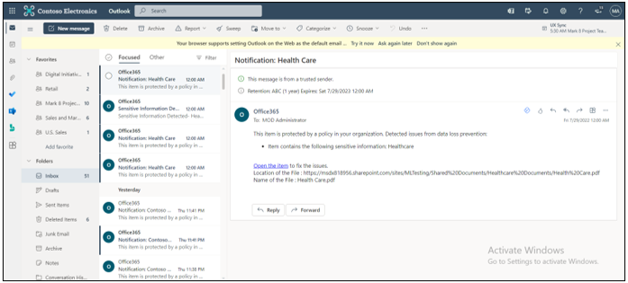 
</figure>
Email Notification: Similarly, once the policy is triggered, you are notified with the email notification (a rule that is defined while creating the DLP policy).
<figure>
    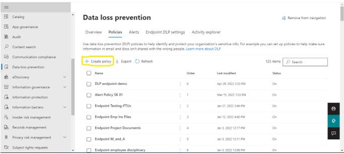 
</figure>
*Protecting Source Code on Endpoint*: Trainable Classifiers can be configured to protect content on endpoint by turning on advanced classification and adding Source Code as a condition in Endpoint policies ..
*Step 1: Create policy*
In the Microsoft Purview compliance portal, navigate to Data Loss Prevention and open the Policies tab:
<figure>
     
</figure>
In the Choose the information tab: Select Custom category and Custom policy template.
<figure>
    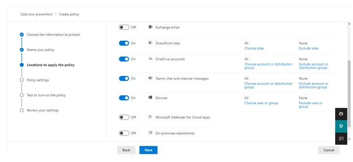 
</figure>
Give a unique name.
<figure>
    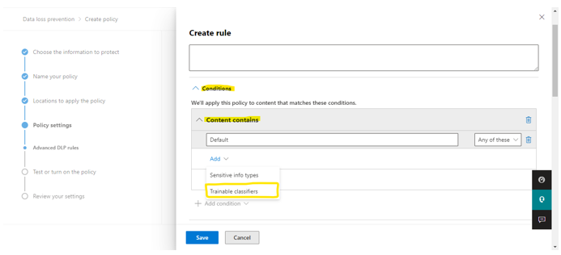 
</figure>
*Step 2: Select Workload*
Choose locations where you want to apply your policies, select *Devices* for Endpoint coverage.
<figure>
    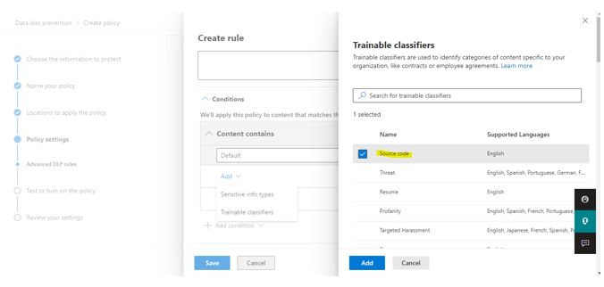 
</figure>
*Step 3: Create rule in Advanced rule DLP*
In conditions, select content contains and click on Trainable classifier
<figure>
     
</figure>
Select *Source code* and click add.
<figure>
     
</figure>
In actions, select *audit or restrict activities on devices.*
<figure>
     
</figure>
*Enable user notification*
Whenever a document is identified as Source Code, mail gets generated and sent to administrators. Save and click next.
<figure>
     
</figure>
In *Test or turn on the policy*, select turn it on right away. Click next and submit.
<figure>
     
</figure>
<figure>
    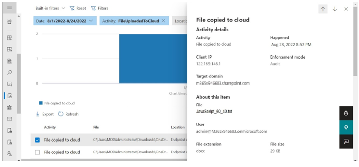 
</figure>
*Step 4: Test policy by uploading documents to SharePoint from Endpoint.*
<figure>
    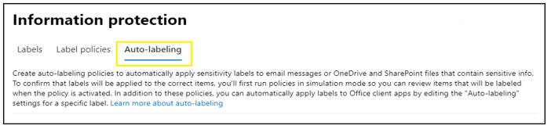 
</figure>
*Step 5: Activity Explorer*
<figure>
    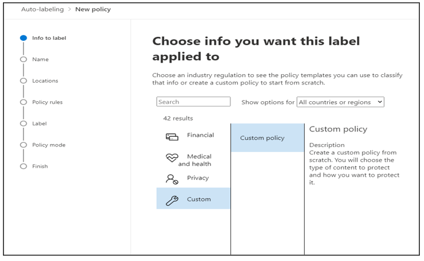 
</figure>
# Create sensitivity auto-labeling policies
*Step 1: Create Sensitivity Auto-Labeling Policy*
In the Microsoft Purview compliance portal, navigate to sensitivity labels:
Solutions > Information protection
If you don't immediately see this option, first select Show all.
Select the Auto-labeling tab
<figure>
    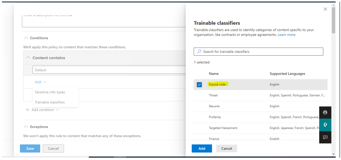 
</figure>
*Step 2: Policy Configuration*
Select + Create auto-labeling policy. This starts the new policy configuration:
<figure>
     
</figure>
*Step 3: Select Workloads*. For the page Choose locations where you want to apply the label: 
<figure>
    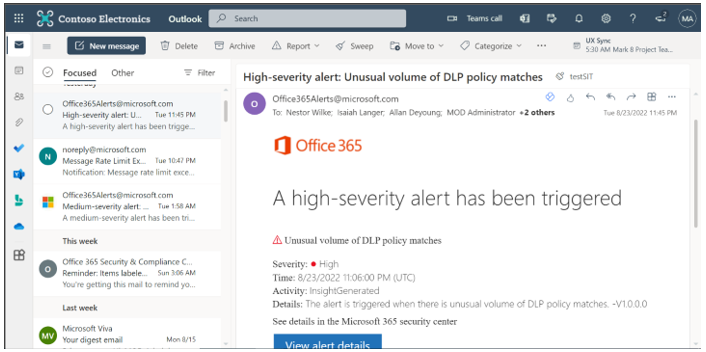 
</figure>
Select and specify locations for Exchange, SharePoint, and OneDrive. If you don't want to keep the default of All included for your chosen locations, select the link to choose specific instances to include, or select the link to choose specific instances to exclude. Then select Next.
For the Set up common or advanced rules page: Keep the default of Common rules to define rules that identify content to label across all your selected locations. If you need different rules per location, including more options for Exchange, select Advanced rules. Then select Next.
Depending on your previous choices, you'll now have an opportunity to create new rules by using conditions and exceptions.
When you've defined all the rules you need, and confirmed their status is on, select Next to move on to choosing a label to auto-apply.

*Step 4: Add Trainable Classifier as a condition to create policy*
When you select the Trainable classifiers option, select one or more of the pre-trained or custom trainable classifiers:

The available pre-trained classifiers are often updated, so there might be more entries to select from the ones displayed in this screenshot.

*Step 5: Policy Applied*
Incoming email is labeled when there is a match with your auto-labeling conditions. 
When the encryption isn't applied for senders outside organization, however, it can be applied by configuring Additional settings for email and specifying a rights Management owner.

<figure>
     
</figure>

<figure>
     
</figure>
