!!! Note "How to use this guide"
    Please use this guide as a starting point for protecting your sensitive information in Microsoft Teams communication channels via Unified DLP. All links and references should be up to date, however, if you have a question about the correctness of any information in this document, please reach out to our [yammer group]( aka.ms/askmipteam ).

    All screenshots in this guide contain the proper configuration settings according to the best practices at the time of publication. Please ensure that your configurations mirror those used in this guide. Please refer to the Microsoft documentation online at docs for the latest updates

    Though the name of this document is shown as a play book, it can be equally considered a deployment guide. This document will be updated as and when new features are introduced to Microsoft Teams DLP. There are few abbreviations used in the document and please refer, [Abbreviations](#abbreviations) of this document.

    This document covers in detail various use cases that can be achieved using Teams-DLP.

## Introduction

This playbook provides an overview of how enterprise customers can deploy Microsoft Teams-DLP for protecting sensitive information that is coming/going within or outside of the organization. Unified DLP has integration with multiple workloads that help to protect customer data with a single policy. Teams-DLP is one of the workloads within the Unified-DLP console. This playbook walks through the various aspects of deploying use cases across content/containers and shows the effectiveness of the unified DLP portal as a single place to define all aspects of your DLP strategy.

Using this play book will help to:

* Understand the unified console and interface.
* Develop a strategy for deploying Teams-DLP across the organization.
* Provide near real time Alerts with notifications.
* Review various scenarios to test Teams-DLP over chat and channel communication.

This playbook helps readers plan and protect sensitive information scenarios that normally exist in every organization. It also helps as a user guide to mitigate the risk of exchanging crucial data while communicating over chat or giving access to sites for guest users. 

We are making the assumption one has identified the Sensitive Information Types (SITs) that are to be protected In Teams Chat or Channel messages. 

!!! Info
    For more information on data classification click [here](aka.ms/dataclassificationwhitepaper) and the deployment accelerator guide click [here](../../dag), please refer to the Appendix section in the whitepaper or Sensitivity Label Taxonomy section in the [DAG](../../dag/mip-dlp). 


## Overview
Microsoft Information Protection (MIP) helps to identify, discover, classify, and protect sensitive information wherever it lives either at rest or in transit.

<figure>
     
    <figcaption>Figure 1: Microsoft Information Protection Cycle</figcaption>
</figure>

**Know your data** assists in understanding the current data landscape and provides organizations with the ability to identify sensitive content residing in Microsoft 365 across Exchange, SharePoint, OneDrive for Business, and physical devices depending on workloads used and licensing owned.

**Protecting your data** assists in applying flexible protection that includes visual marking, encryption and access restrictions across apps, services and devices that travel inside and outside the organization.

**Prevent data loss (DLP)** assists in preventing accidental data loss and oversharing of sensitive information within or outside the organization. In the Data Loss Prevention capability of MIP, **Global** and **Compliance** admins can create policies across workloads and apply rules to protect data oversharing. Pre-defined built in regulatory templates across various industries are available. Administrators can also create their own custom policies to suit organizational needs.

The URL for creating DLP policies is: [DLP](https://compliance.microsoft.com/datalossprevention).

Login with an appropriate role as described in [Role Requirements](#Role-Requirements) of this document and creating policies inclusive of desired workloads.

<figure>
     
    <figcaption>Figure 2: Microsoft 365 Compliance Portal DLP wizard</figcaption>
</figure>

Data Loss Prevention capabilities are across workloads such as.: Exchange, SPO, ODB, Devices (End point DLP), 3rd party Apps and now to Teams chat and channel messages.

<figure>
    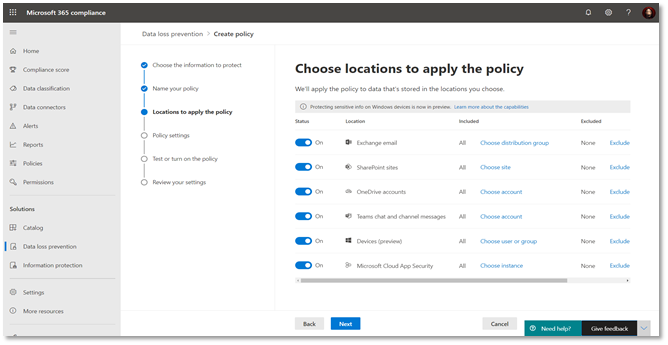 
    <figcaption>Figure 3: Microsoft 365 Compliance Portal – DLP across workloads</figcaption>
</figure>

This playbook explains the process of protecting data in the location “Teams chat and channel messages.” Individuals can view the DLP actions using reports and explore the files that contain sensitive information or have labels applied using the [Content Explorer](https://docs.microsoft.com/en-us/microsoft-365/compliance/data-classification-content-explorer?view=o365-worldwide). The user activities on these labels can be viewed using the [Activity Explorer](https://docs.microsoft.com/en-us/microsoft-365/compliance/data-classification-activity-explorer?view=o365-worldwide).

The below displayed features (Content Explorer & Activity Explorer) are not available on Teams-DLP activities at this moment but on the roadmap. During subsequent releases, the alerts produced during the protection of data can be viewed using DLP-Alerts/Activity Explorer.

Activity Explorer, provides a 360-degree view (also known as **Know your data**) of user risky activities across the tenant and helps administrators take preventive measures. The below figure shows Activity Explorer with detailed metadata of user activity where and when it has happened. 

!!! Note
    Teams-DLP- User Activity in the Activity Explorer is coming soon

<figure>
    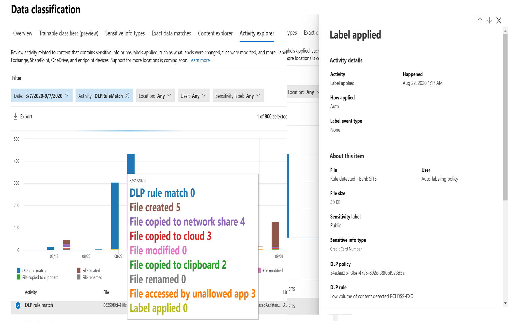 
    <figcaption>Figure 4: Activity Explorer with user activities</figcaption>
</figure>

Similarly, MIP has a Content Explorer which is part of the Data Classification dashboard. Content Explorer shows a current snapshot of items with sensitivity labels, retention labels and (SITs) in your organization. A DLP policy can help protect sensitive information, which is detected through one or more sensitive information types. Definitions for many common sensitive information types from across many different regions that are ready to use. For example, a credit card number, bank account numbers, national ID numbers, and Windows Live ID service numbers.

<figure>
     
    <figcaption>Figure 5: Content Explorer with summary view</figcaption>
</figure>

Upon further drill down, the exact file and location containing sensitive information can be viewed for further action or protection, along with data pertaining to the last modification date and user.

!!! Tip
    For both features (Activity Explorer and Content Explorer), separate role-based access is required to view the files [Role Requirements](#role-requirements). These are on the at this time for Teams-DLP activities.

## Licensing Requirements
Office 365 Advanced Compliance, which is available as a standalone option and is included in Office 365 E5 and Microsoft 365 E5 Compliance. Office 365 and Microsoft 365 E3 include DLP protection for SharePoint, OneDrive, and Exchange Online. This also includes files that are shared through Teams because Teams uses SharePoint Online and OneDrive to share files. **Support for DLP protection in Teams chat and channel messages requires E5**. To learn more about licensing requirements, see [Licensing Guide](http://aka.ms/mipc/licensing).

## Role Requirements
To create DLP policies or rules in the Microsoft 365 Compliance Center (MCC), the user should have a role of **Global Admin** or **Compliance Admin** or **Compliance Data Admin**.

An additional role is required to view Content Explorer or Activity Explorer.

To view the data visualization in the Data Classification module, there are two roles that grant access to content explorer [RBAC](https://docs.microsoft.com/en-us/microsoft-365/security/defender-endpoint/rbac?view=o365-worldwide):

**Content Explorer List viewer**: Membership in this role group allows you to see each item and its location in list view. The data classification list viewer role has been pre-assigned to this role group.
**Content Explorer Content viewer**: Membership in this role group allows you to view the contents of each item in the list. The data classification content viewer role has been pre-assigned to this role group.

## Data Loss Prevention for Teams-DLP
A DLP policy helps organizations prevent data loss. It also helps users to make better decisions when sending SITs knowingly or unknowingly. The process of creating a unified DLP policy with Teams as the workload is explained in the later sections of this document. 

!!! Tip
    Please refer to [User Experience](#user-experience), before starting this process.

Currently, Teams-DLP supports protecting data while sharing a message or a file that contains sensitive information via 1-1 chat or through channel messages. Below are some of the scenarios of an elevated level. The detailed screenshots with test results have been explained in [User Experience](#user-experience) of this document.

### Protecting Sensitive Information in Messages:
If someone is trying to share a chat message that contains sensitive information to an external user or guest, based on the creation of DLP-Rule for the Teams workload, the message will be blocked within seconds. Both the sender and receiver see the message blocked notification.

### Protecting Sensitive Information in Documents Sharing:
If a user attempts to share a document that contains sensitive information with external users or guests in a Microsoft Teams channel or chat, the DLP rule prevents opening the document by the external user. In this case, the DLP policy must include SharePoint and OneDrive locations in order for protection to be in place.

When new files are added to SharePoint or OneDrive in Microsoft 365, it may take a few moments for them to be crawled and indexed. It takes additional time for the [Office Data Loss Prevention (DLP) policy](https://docs.microsoft.com/en-us/microsoft-365/compliance/data-loss-prevention-policies) to scan the content and apply rules to help protect sensitive information. If external sharing is turned on, sensitive content could be shared and accessed by guests before the Office DLP rule finishes processing.

You can ensure that documents are protected until DLP scan completes and marks them as safe to share by using a PowerShell cmdlet to enable a feature called **sensitive by default**:

    Set-SPOTenant -MarkNewFilesSensitiveByDefault BlockExternalSharing

* Use the cmdlet   ```BlockPerUserNotifyUserOutsideOrg```

**Conditions** 

* Content contains any of these sensitive info types: [Select all that applies]

* Content is shared from Microsoft 365 with people **outside my organization**.

**Action**

* Restrict access to the content for external users. 

* Notify users with email and policy tips.

* Send incident reports to the Administrator.

!!! Info "More Information"
    For additional information on **sensitive by default**, refer [here](https://docs.microsoft.com/en-us/sharepoint/sensitive-by-default).

### Protection of Teams and SharePoint sites:
Sensitivity labels can be used to protect data not only in documents and emails, but also in Teams and SharePoint sites. During creation Teams settings can be defined such as: Private (or public), external user access and access from unmanaged devices. When you apply a sensitivity label to a supported container, the label automatically applies the classification and configured protection settings to the site or group. Referring to [using sensitivity labels in Teams, Groups or SharePoint sites](https://docs.microsoft.com/en-us/microsoft-365/compliance/sensitivity-labels-teams-groups-sites?view=o365-worldwide#using-sensitivity-labels-for-microsoft-teams-microsoft-365-groups-and-sharepoint-sites).

This helps protect your Teams and SharePoint sites holistically and not just individual files within those sites. There are various control options available in the M365 compliance center to enable various group settings and to restrict sharing of sensitive information via chat or by sharing the files. The sensitivity labels are then available to a user who is creating a new Team.

### Scoping of Teams-DLP policy:
Teams DLP policy scoping are different from other location such as Exchange, SharePoint, etc. The policy is scoped on the types of chats based on the user or groups chosen. M365 Groups are used to scope public (standard channel and shared channel) chats. Users, Security Groups, or Distribution Groups are used to scope non-public (1:1/n and private channel) chats. Refer [here](https://learn.microsoft.com/purview/dlp-microsoft-teams#scope-of-dlp-protection) on the latest scoping definition.

#### Example - Exclude chats from specific Teams channels:
There are cases when there is a need to exclude certain channels from oversharing, such as the channels for Sales in Teams to handle credit card information. In the Microsoft 365 compliance center, select All users and groups and check the Exclude users and groups checkbox and then add the desired M365 Group.

<figure>
    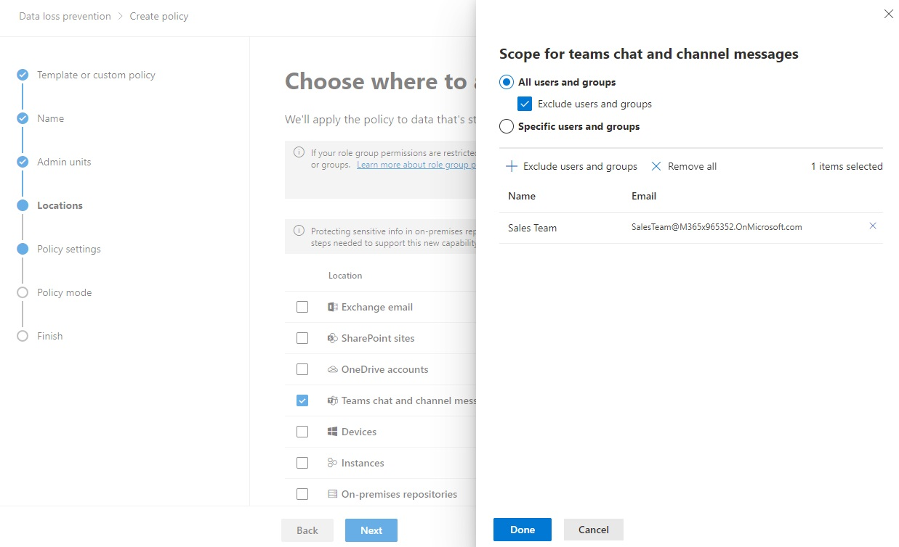 
    <figcaption>Scoping a policy by selecting a M365Group to excluding channels associated with the group in your organization.  In this example, the policy will exclude the standard and shared channels under the Sales Teams team.
</figure>
        
#### Example - Exclude all chats for a group of users
There are cases when there is a need to customize a policy such as allowing support and operations department to handle credential information. In the Microsoft 365 compliance center, select Specific users and groups and then add the desired security group _and_ a M365 Group into the policy.

<figure>
     
    <figcaption>Scoping a policy by selecting both a M365Group _AND_ security group to exclude all chats for specific members in your organization.  In this example, Support SG and Operations M365 Group have the same set of members.
</figure>

To ensure the policy are updated as group membership changes, it is important to consider synchronizing the M365Group and security gropus regularly. See the article [Syncing Security Groups with Microsoft Teams](https://techcommunity.microsoft.com/t5/microsoft-teams-blog/syncing-security-groups-with-team-membership/ba-p/241959) to automate the group membership syncrhonization. This will allow configuring policies for geo-specific targeting, department scoping, or other functional unit specialization.

## Teams and Guest Access
**Guest** is a user type in Microsoft Teams which is included with Office 365 licenses. With guest access, you can provide access to teams, documents within channels, resources, chats, and applications for people external to your organization. 

In a real-life scenario, guests may be a vendor, a supplier or an external partner who is working on a project but is not a member of your organization and has a business account (Azure AAD) or consumer email account (Outlook, Gmail, Hotmail, etc.). They can participate as guests in Teams and explore the channel experiences.

External Access (**Federation**) is turned on by default in Teams, which means your organization can communicate with all external domains. The Teams admin can turn it off or specify which domains to include or exclude. Federation users do not have access to your organization’s Teams or Teams’ resources. **They can only communicate via 1-1 chat**. If a federation user needs access to Teams’ channels and resources, they must be added as a **guest** in the organization.

The setting up of guest and federation users has been explained in [Requirements for Federation or Guest user scenarios](#requirements-for-federation-or-guest-user-scenarios).

Let's start with the explanation below.

1. Organizations (sender and receiver) which have O365 licenses and Teams enabled, can start 1-1 chats/meetings/voice calls. 

    * The external user (receiver) will **not** be added by default to AAD and will not get access to internal resources like files or folders. This external user will be considered a one-time user and which we call a **Federation user**.

    * If the user needs additional privileges, administrators will provide access by converting them to a guest user.

2. If a member has been added to a Teams channel, the user profile will be automatically added (forced to add) to Azure Active directory and will be treated almost as an internal user (refer figure below). **This user is an external or guest user**.

    **Federation:** 
    **Teams support 1:1 federation chat only**. Teams do not currently support:

    * Group Chats with one or more federation users

    * Channel conversations with federation users

<figure>
     
    <figcaption>Figure 6: Adding members to external chat</figcaption>
</figure>

To set-up guest access, please refer [here](#step-2-add-a-guest-user). The detailed comparison of Team member and guest has been explained in this [section](https://docs.microsoft.com/en-us/MicrosoftTeams/guest-experience#comparison-of-team-member-and-guest-capabilities). When a guest is invited to join a team, they receive a link to accept. The guest must accept the invitation before joining the team and the associated channels. 

Below is the admin experience of adding additional privileges. Login to [Guest access - Microsoft Teams admin center](https://admin.teams.microsoft.com/company-wide-settings/guest-configuration). 

<figure>
     
    <figcaption>Figure 7: Admin experience at Microsoft admin center for controlling guest access.</figcaption>
</figure>
<figure>
    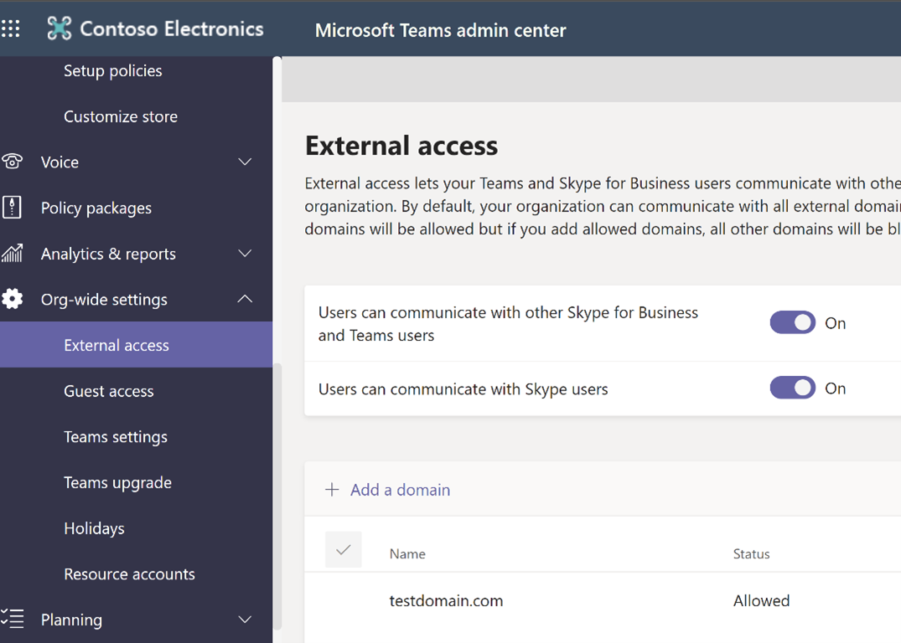 
    <figcaption>Figure 8: External access setting allows – Chat/voice calls/meetings for federation domains.</figcaption>
</figure>

## Requirements for Federation or Guest user scenarios

To test the scenarios a Teams-DLP policy is required along with a guest and federation user. Below steps help in setting up the DLP-Policy and adding new guest users.

### <span style="color:blue">Step 1: Create Teams-DLP policy</span> 

DLP policies help organizations prevent data loss. The process of creating a unified DLP policy with Teams as the workload is explained in the process below. Please refer to the [User Experience](#user-experience) section before the start of this process.

* Login to *compliance.microsoft.com* and click on Data Loss Prevention
* Click on the create policy.

<figure>
     
    <figcaption>Figure 9: DLP policy creation</figcaption>
</figure>

By default Microsoft provides Industry standard regulatory templates to protect sensitive information. The templates have been divided into 4 categories – **Financial**, **Medical** and **Health, Privacy** and **Custom**. Each of the first 3 categories have pre-defined data protection templates based on the industry needs. There is also an option to filter based on country and region. If your organization needs a combination of these templates or a new need that is not available in the list, select **Custom Category – Custom Template**. This allows you to choose sensitive types that work for your organization’s needs.

<figure>
    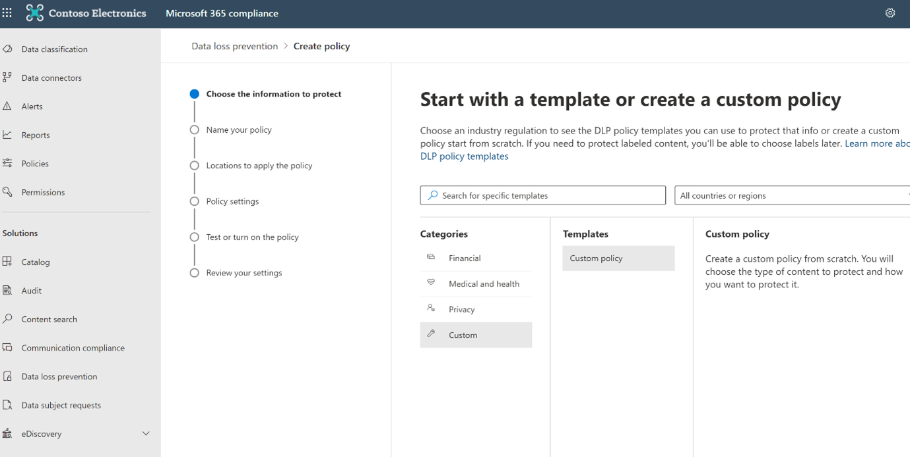 
    <figcaption>Figure 10: Selecting a template</figcaption>
</figure>

<figure>
    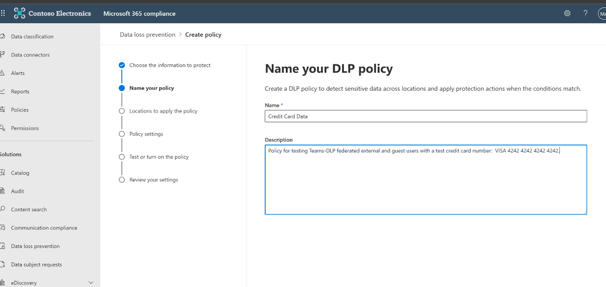 
    <figcaption>Figure 11: DLP Policy name</figcaption>
</figure>

Next, the screen below allows administrators to select the accounts where the chosen sensitive information needs to be protected. It can be implemented across the entire organization, a particular project, or a particular entity of the organization. Also, there is an option to explicitly exclude some accounts from this protection based on the need. If you do not define any explicit inclusions or exclusions, the policy will apply to **All Employee** with No Exclusions by default.

<figure>
     
    <figcaption>Figure 12: Policy applies to desired locations.</figcaption>
</figure>

Once the applicable project team and business entities to be protected are selected, we need to create a rule and action on the policy as shown on the screen below. 

Create a rule by adding conditions (*is this rule applicable to Within the Organization or Outside the Organization*) and under content contains, add the sensitive information types which were identified as part of the data classification needs of your organization. In the list of sensitive information types, one has the ability to select SIT’s that were created using regular expressions, out of the box (OOB) provided, and matching keywords.

<figure>
     
    <figcaption>Figure 13: Creation of DLP rules</figcaption>
</figure>

Add exceptions if any and then create actions. By default users are blocked from sending the Teams chats and channel messages that contain the SIT you are protecting. But you can choose who has access to files shared from SharePoint, OneDrive, and Teams

Click Next, you can enable the policy right away or you can choose to test for a few days before enabling, as shown below.

<figure>
    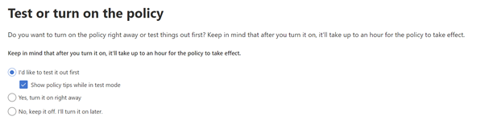 
    <figcaption>Figure 14: Test first and then deploy.</figcaption>
</figure>

### <span style="color:blue">Step 2: Add a Guest User</span> 

Guest users can be added in two ways: From Azure Active Directory or from the Channel->Add member screen in Teams.

[New user - Azure Active Directory admin center example](https://aad.portal.azure.com/#blade/Microsoft_AAD_IAM/UsersManagementMenuBlade/MsGraphUsers) 

<figure>
    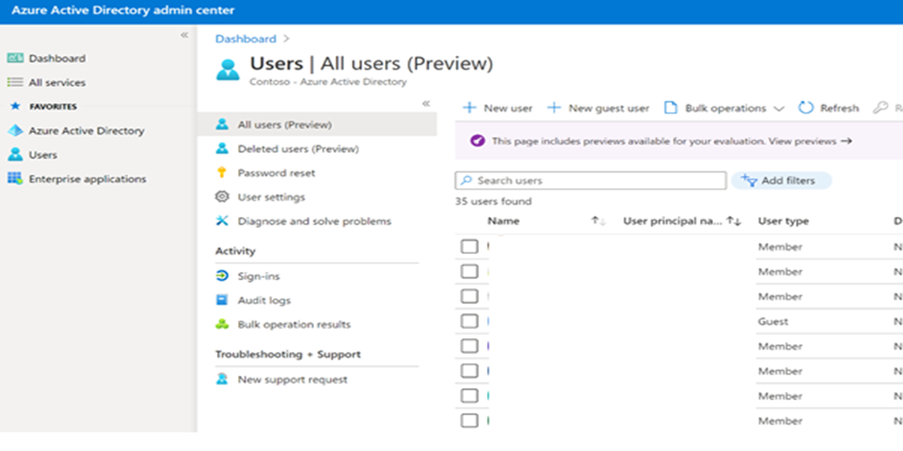 
    <figcaption>Figure 15: Adding a guest user through Azure Directory</figcaption>
</figure>

<figure>
    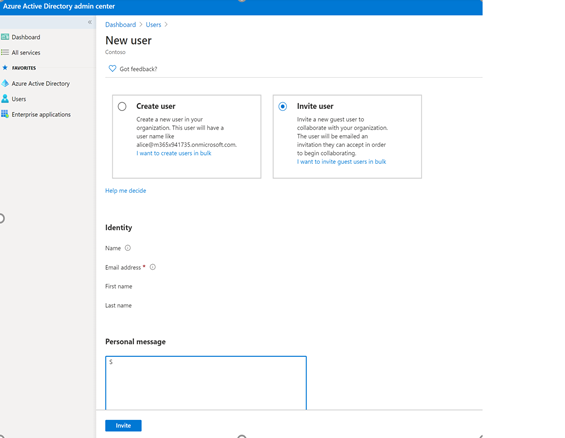 
    <figcaption>Figure 16: Sending Invite to guest user</figcaption>
</figure>

<figure>
    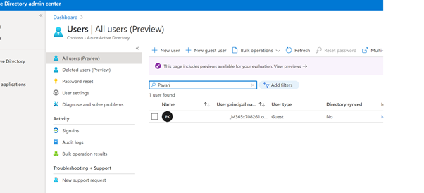 
    <figcaption>Figure 17: The user added to AAD</figcaption>
</figure>

Once added the new guest user receives a message as shown below:

<figure>
    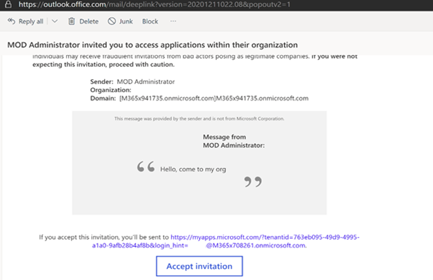 
    <figcaption>Figure 18: E-mail message to guests with a link to accept</figcaption>
</figure>

Upon acceptance the guest user then receives the following message: 

<figure>
    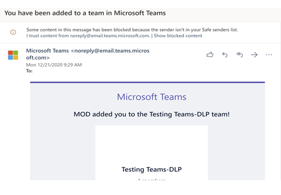 
    <figcaption>Figure 19: E-mail message after successful addition</figcaption>
</figure>

From this point the user is a member of AAD and has access to all tenant resources, just like an internal user. The admin can restrict access based on organizational needs.


### <span style="color:blue">Step 3: Create a Teams Channel</span> 

In the above steps we have created a DLP policy and added an external user. It is important to consider protecting your Teams channel messages holistically and not just individual files within those sites. There are various control options available in the M365 compliance center to enable various group settings and to restrict sharing of sensitive information via chat or by sharing the files. The sensitivity labels are then available to a user who is creating a new team.

At a Team channel or site level, three types of controls are possible: 

1.	Who can join a Team?
    a.	Privacy – **Public** vs **Private**
    b.	Choose **public** for anyone in your organization to join the team, or **private** for only selective members can join the team.
    c.	Control whether the Team owner can [add guests](https://docs.microsoft.com/en-us/microsoft-365/admin/create-groups/manage-guest-access-in-groups?view=o365-worldwide) to the team.

2.	Control access to Teams sites from unmanaged devices
    a.	For [unmanaged devices](https://docs.microsoft.com/en-us/sharepoint/control-access-from-unmanaged-devices) (those not [hybrid AD joined](https://docs.microsoft.com/en-us/azure/active-directory/devices/overview#hybrid-azure-ad-joined-devices) or complaint on Intune), allow full access, web only access, or block access completely.

3.	Granular control for external sharing of files in Teams sites.
    a.	Choose the level of [external sharing](https://docs.microsoft.com/en-us/sharepoint/external-sharing-overview): anonymous, secure external sharing, or block external access completely.

Let us create a Teams channel and add a user to the channel:

<figure>
     
    <figcaption>Figure 20: New Teams Channel creation</figcaption>
</figure>

<figure>
     
    <figcaption>Figure 21: Choosing Privacy setting </figcaption>
</figure>

<figure>
     
    <figcaption>Figure 22: Channel name and purpose</figcaption>
</figure>

Next add a new external user to the newly created channel. Please note that the first user was added through the AAD admin center and this user *Gmail account* is being added through Teams channel -> Add member.

<figure>
     
    <figcaption>Figure 23: Adding guest users as a member to the newly created channel</figcaption>
</figure>

Please note that this newly added user will automatically be added to AAD, as displayed below:

<figure>
     
    <figcaption>Figure 24: Checking the added user from the AAD admin center</figcaption>
</figure>

In the above steps, we have added 2 users. These 2 users are now added to AAD.

1. *@M365x708261.onmicrosoft.com* 
2. *@gmail.com*

### <span style="color:blue">Step 4: Add External (Guest) or Federation User</span> 

Next, let us attempt to add a new user, who is a federation and should not be part of AAD. Refer to [here](https://docs.microsoft.com/en-us/microsoftteams/communicate-with-users-from-other-organizations#compare-external-and-guest-access) for more details. 

When trying to add the 3rd new user to the existing Teams channel, assume that the user has an O365 license in the tenant. When attempting to add the user directly from Teams, the application only allows the user to be added as a guest user *@M365x708261.onmicrosoft.com*. Since we do not want this user to be added to AAD we will keep them as federation users (or One-time chat user).

<figure>
    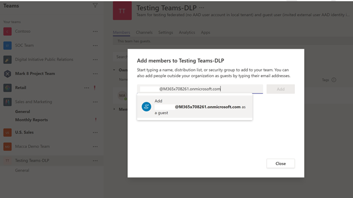 
    <figcaption>Figure 25: Trying to add a Federation user to the channel.</figcaption>
</figure>

We now have 2 guest users, a federation user, a Teams-DLP rule, and a Teams channel. We are ready to test the scenarios.

## User Experience

### <span style="color:blue">Scenario 1: Sharing Credit card details to a Federation user via 1-1 chat.</span> 

<span style="color:green">Sender’s Screen:</span> 

The Sender is attempting to send credit card information to the newly created federation user via 1-1 chat:

<figure>
     
    <figcaption>Figure 26: Credit card information in Team chat</figcaption>
</figure>

The message is blocked as the DLP rule is activated and the sender is notified:

<figure>
    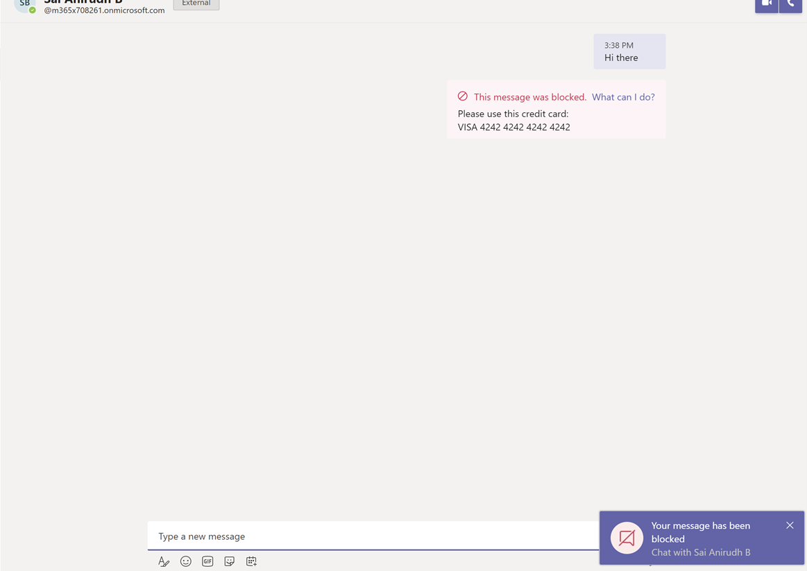 
    <figcaption>Figure 27: Blocked credit card message</figcaption>
</figure>

<span style="color:green">Receiver Screen:</span> 

The receiver gets a blank blocked message, as shown below. Please note that there will be a delay of a few seconds in blocking the message and which is normal behavior (passive DLP).

<figure>
    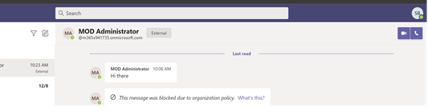 
    <figcaption>Figure 28: Blank blocked message</figcaption>
</figure>

### <span style="color:blue">Scenario 2: Sharing a file from SharePoint /OneDrive to Federation user.</span> 

<span style="color:green">Senders Screen:</span> 

The Sender is trying to attach a file which has credit card information via 1-1 chat:

<figure>
    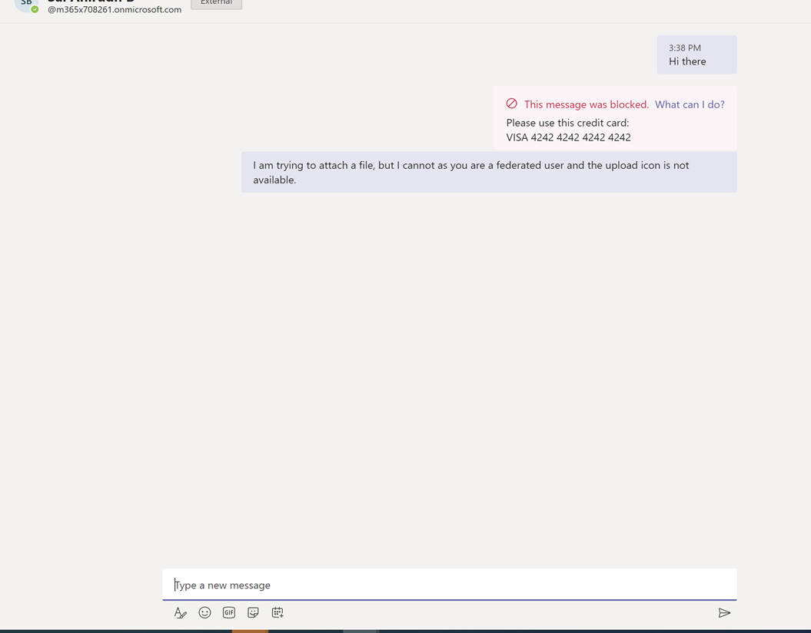 
    <figcaption>Figure 29: Option to upload files missing</figcaption>
</figure>

Notice there is no option to upload a file to the federation user since they are not in AAD.


<span style="color:green">Receivers Screen:</span> 

In this scenario the receiver will not get a message.

<span style="color:blue">Scenario 3: Sharing Credit card details with a Federation user via 1-1 chat.</span> 

If the federation user (Sender) has shared a SIT via 1-1 chat, the DLP rule acted will be based on the federation user organization policies. In the above scenario, if a credit card is not a SIT in the federation user's organization, the message will come as-is to the receiver. The receiver will not have any control over the federation users' DLP policies.

### <span style="color:blue">Scenario 4: Sharing Credit card details to Guest user via 1-1 chat.</span> 

The Sender and Receiver can chat, just like an internal user since the guest is a member of AAD. The Sender then attempts to share sensitive information via chat:

<span style="color:green">Senders Screen:</span> 

<figure>
     
    <figcaption>Figure 30: Guest user Teams chat</figcaption>
</figure>

The DLP rule is activated and the message is blocked:

<figure>
     
    <figcaption>Figure 31: DLP blocked message</figcaption>
</figure>

<span style="color:green">Receivers Screen:</span> 

The Receiver receives the blocked message, as shown below:

<figure>
     
    <figcaption>Figure 32: Blocked message to receiver</figcaption>
</figure>

### <span style="color:blue">Scenario 5: Sharing a file via 1-1 chat with Guest User.</span> 

<span style="color:green">Senders Screen:</span> 

The Sender is trying to attach a file, which has credit card information, via 1-1 chat to the guest user:

<figure>
     
    <figcaption>Figure 33: Attaching a file in chat with credit card information</figcaption>
</figure>

<figure>
     
    <figcaption>Figure 34: Attaching a file in chat with credit card information<</figcaption>
</figure>

<figure>
     
    <figcaption>Figure 35: Attaching a file in chat with credit card information<</figcaption>
</figure>

<span style="color:green">Receivers Screen:</span> 

This message was received by the receiver:

<figure>
     
    <figcaption>Figure 36: UI message to receiver</figcaption>
</figure>

The receiver while attempting to open the attachment:

<figure>
    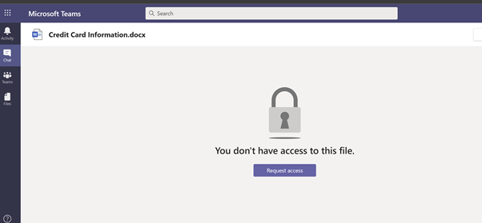 
    <figcaption>Figure 37: Error message when opening file</figcaption>
</figure>

And upon clicking **Request Access**:

<figure>
    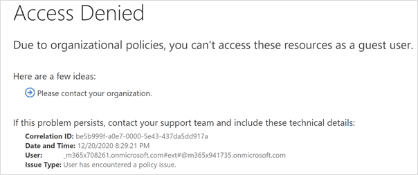 
    <figcaption>Figure 38: Access Denied message</figcaption>
</figure>

### <span style="color:blue">Scenario 6: Sharing Credit card details to Guest users via Teams channel chat.</span> 

<span style="color:green">Senders Screen:</span> 

The Sender attempts to share a credit card number via the channel chat:

<figure>
     
    <figcaption>Figure 39: Attaching a file in channel with credit card information</figcaption>
</figure>

<figure>
     
    <figcaption>Figure 40: Attaching a file in channel with credit card information</figcaption>
</figure>

<span style="color:green">Receivers Screen:</span> 

The message was blocked. 

<figure>
     
    <figcaption>Figure 41: Message blocked in Teams channel</figcaption>
</figure>

### <span style="color:blue">Scenario 7: Sharing a file to a Guest User on Teams channel</span> 

<span style="color:green">Senders Screen:</span> 

The Sender attempts to share a file that has credit card number details over the chat in the channel:

<figure>
    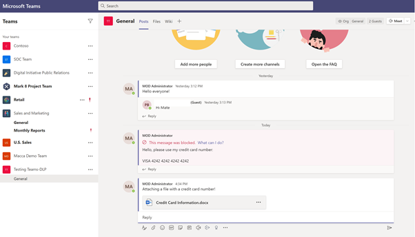 
    <figcaption>Figure 42: Attaching a file in channel with credit card information</figcaption>
</figure>

<span style="color:green">Receivers Screen:</span> 

The Receiver gets the message and, upon opening the file, receives an access denied message.

<figure>
    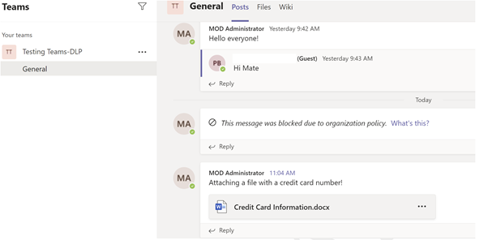 
    <figcaption>Figure 43: Error messages when opening</figcaption>
</figure>

<figure>
    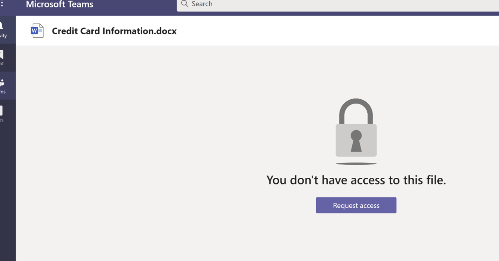 
    <figcaption>Figure 44: Error messages when opening</figcaption>
</figure>

<figure>
    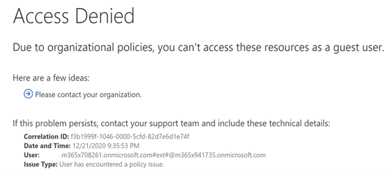 
    <figcaption>Figure 45: Error messages when opening</figcaption>
</figure>

## Reports

After creating the DLP policies or rules on the desired workload (i.e., Teams Chat or Channel), you can track the actions using the reports in the Microsoft 365 Compliance Center.

**Compliance.microsoft.com -> Reports -> Organization Data > Select Teams**.

Or

[https://compliance.microsoft.com/reports/dlppolicymatchesreport](https://compliance.microsoft.com/reports/dlppolicymatchesreport)

This report shows the count of DLP policy matches over time. You can filter the report by date, location, policy, or action. This report can help discover the business processes that may violate the organization’s DLP policies and understand the impact created by the action that is applied on the content. It also helps identify the list of top users and repeat users who are contributing to incidents within your organization. Highlighted in red boxes indicates key filters or features in the reports.

<figure>
     
    <figcaption>Figure 46: DLP-Reports</figcaption>
</figure>

<figure>
    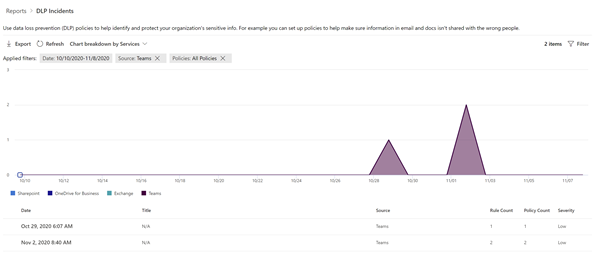 
    <figcaption>Figure 47: DLP-Incidents</figcaption>
</figure>

<figure>
     
    <figcaption>Figure 48: DLP-Summary</figcaption>
</figure>

To view the reports in the Microsoft 365 Compliance Center, the user needs to be a member of the Security Reader role group. By default, this role group is assigned to the Compliance Administrator. 

## Implementation Strategy

See [Microsoft 365 productivity illustrations](https://docs.microsoft.com/en-us/microsoft-365/solutions/productivity-illustrations?view=o365-worldwide) for guidance on implementation of all M365 capabilities with a focus on cross technologies. 

Based on experience, a solid Implementation strategy follows these three phases

**Crawl** -The first stage is about starting to evaluate where your organization is today regarding security and compliance with your goal of defining a strategic direction for your company. Use this strategy to foster adoption of a solution by gathering the requirements of supporting systems, impact on end users, and skillset needed for each role owner. The crawl phase describes steps you should do at the beginning of any deployment, whether your requirements are basic or advanced. It includes steps for education, defining requirements, and evaluation or testing. 

This phase is primarily to identify data classification needs like, Identifying the key critical Sensitive Information Types (SIT)

**Walk** -The second stage builds the foundation for a successful, scale, and sustainable deployment. In this phase, you plan the details of your implementation and to build the solution. You may also run a pilot or proof of concept with a select group of users or locations. 

This phase deals with protecting the identified, SIT’s. This can be done either by labelling the documents or by applying rules across workloads. Test these policies on certain users/groups before deploying directly into production.

**Run** -The last stage is about optimizing the solution for Microsoft 365. In this phase you will set up an automated scalable approach for each solution. 

Keep monitoring the results and fine tune the rules. Validate the results through alerts/reports and take measures.

For more details on deployment strategy, visit the [MIP DAG](../../dag/mip-dlp/)

<figure>
     
    <figcaption>Figure 49: Phases of Implementation</figcaption>
</figure>

## FAQ

**Are there any guidance documents for implementing MIP in various industries, i.e., education, healthcare and finance have quite unique needs?**

*Here is some industry guidance for security and compliance:* 
Industry guidance for S+C

**Do DLP policies apply to data that are sent from teams to apps that are added to a channel?**

*No, this scenario is not supported today but is on our roadmap. No ETA at this time.*

**Is it on the roadmap that Sensitivity Labels also gets supported in Teams-DLP?**

*Yes, it is on our roadmap.*

**I have external contact and I (accidentally or intentionally) share an SSN in teams, if the team’s policy is in place to restrict SSN to external parties, is this saying that the msg containing the SSN will not go through?**

*Yes, that is correct. The DLP rule will activate and protect data sharing.*

**Is an integration between MIP and Teams planned so that each document that is exchanged through a channel inherits a Sensitivity Label (visual marking and / or protection?**

*There is a roadmap item to have documents inherited from MIP container labels. There is no ETA at this time.*

**If you upload a document to a Teams chat, does DLP scan the document.**

*Use the sensitive by default setting to protect the document until it is scanned to determine if it contains sensitive info. It will be scanned within a few seconds and blocked if necessary.*

**Does Teams respect apps that have been approved/blocked in MCAS?**

*No, not today. We can look into supporting it in the future.*

**I understand that we are eventually "deprecating" Streams and recordings will be stored in SPO/OD4B. How can we best utilize DLP for Teams in this scenario?**

*No plan today but this is in our roadmap.*

**There is always a delay of a few seconds before the message gets blocked. Are there any performance improvements planned to handle this?**

*We are looking into building a better pipeline, but this is a major undertaking. It is on our roadmap with no clear timelines.*

**How can we block uploaded and downloaded documents on native Teams clients?**

*You can control document storage for Teams through SharePoint DLP, which acts as the backend for Teams document management.*

## Abbreviations

|Name|Description|
|---|---|
|MIP|Microsoft Information Protection|
|DLP|Data Loss Prevention|
|SCC|Security and Compliance Center (Portal to create policies)|
|RBAC|Role Based Access Control|
|SIT|Sensitive Information Type|
|SPO|Share Point Online|
|EXO|Exchange Online|
|ODB|One Drive for Business|
|OOB|Out of the box|
|AAD|Azure Active Directory|

